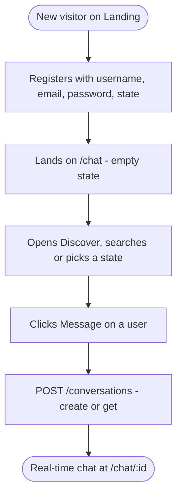
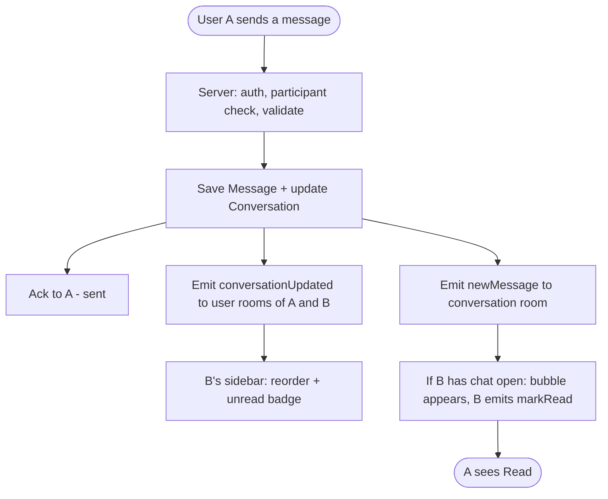
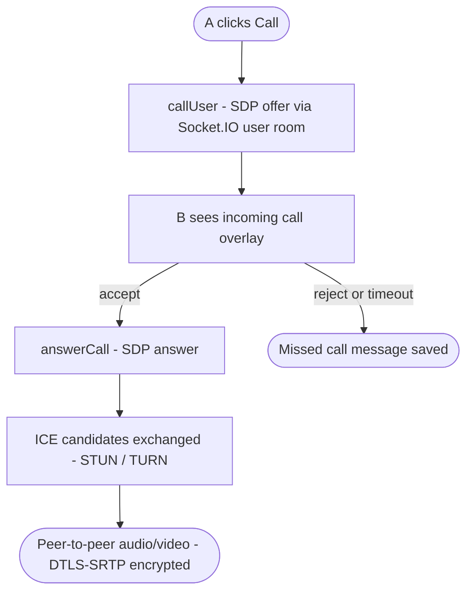
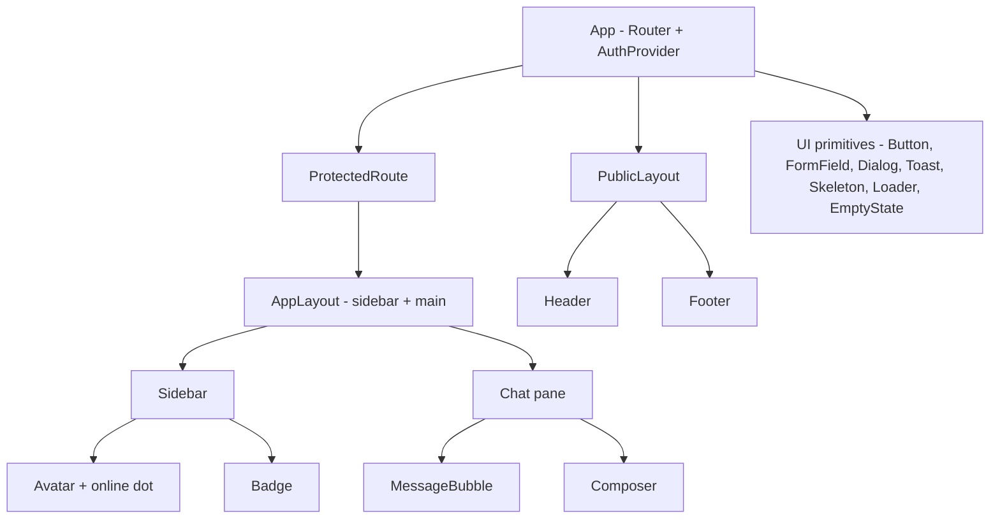
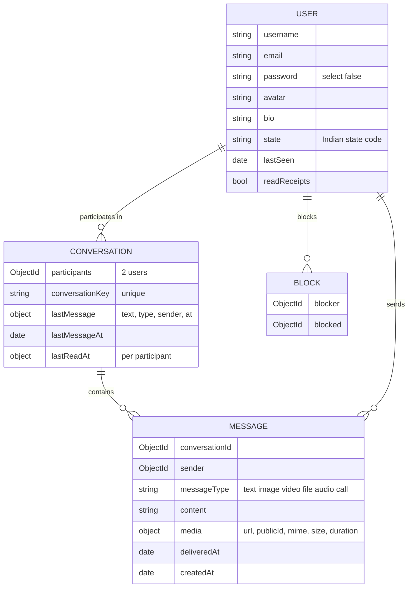

# Project Plan — OpenChat

**Status:** Planning (awaiting approval) · **Last updated:** 2026-09-25 · **Next step:** 1 – Checkpoint current work

> How to use this file: it is the single source of truth for what gets built and in which order.
> Work happens **one step at a time**: pick the next `todo` → build only that → test (two users) → cleanup → mark `done` → the user commits.
> If the plan changes, update this file (and `docs/blueprint.html`) first, then code.

## 1. Overview

- **What:** A real-time, open-world 1:1 communication platform. Any registered user can find and message any other user, with no friend requests.
- **For whom:** Users across India. A signature feature shows live presence per Indian state.
- **Primary goal:** Two strangers can find each other, chat in real time, share media and call each other, securely.
- **Learning goal:** Build every layer properly (REST, Socket.IO, MongoDB, WebRTC, auth, security, UI craft) and understand it.
- **Stack (existing):**
  - Client: React 19 + Vite, axios, socket.io-client.
  - Server: Express 5, Mongoose 9, Socket.IO 4, JWT in an httpOnly cookie, bcrypt.
  - Database: MongoDB.
- **Stack (planned additions, each added only in the step that needs it):**
  - React Router
  - Tailwind CSS v4 + shadcn/coss ui
  - `motion`
  - `three` + `@react-three/fiber` + `@react-three/drei`
  - Vitest + supertest
  - Cloudinary
  - helmet + express-rate-limit
- **Deadline:** none. Quality and understanding over speed.
- **Ground rules:**
  - Keep the existing Route → Controller → Service → Model layering, `AppError` plus the central error handler, and deriving identity on the server (`req.user.userId`, `socket.userId`).
  - JavaScript, no TypeScript migration.
  - No new library unless the step needs it.
  - The user makes every git commit. Agents only propose a checkpoint.

## 2. Sitemap

- `/chat`, `/chat/:conversationId`, `/discover`, `/settings` and `/u/:username` are **protected**: they redirect to `/login` without a session.
- `/login` and `/register` redirect to `/chat` if the user is already logged in.
- The call UI is an **overlay**, not a page, so a call survives navigating between chats.

## 3. Pages and sections

### Landing `/` (public)
| # | Section | Purpose | Components | Links / CTAs |
|---|---|---|---|---|
| 1 | Header | Brand + auth links | Header, Button | /login, /register |
| 2 | Hero | Promise and a 3D visual (live India presence globe/map, poster fallback) | Hero3D (lazy), Button | /register |
| 3 | Features | Messaging, media, calls, presence | FeatureGrid | – |
| 4 | Live presence teaser | Aggregate online counts per state | IndiaPresence (lazy) | /register |
| 5 | Footer | Links, copyright | Footer | – |

### Login `/login` and Register `/register`
| # | Section | Purpose | Components | Links / CTAs |
|---|---|---|---|---|
| 1 | Auth card | Form with inline errors, loading and disabled states | AuthLayout, FormField, Button | /chat on success |
| 2 | Switch link | "No account? Register" and the reverse | Link | /register ↔ /login |

### Chat `/chat` and `/chat/:conversationId` (protected, the core app)
| # | Section | Purpose | Components | Links / CTAs |
|---|---|---|---|---|
| 1 | App shell | Two panes on desktop, one pane at a time on mobile | AppLayout | – |
| 2 | Sidebar | Own avatar/menu, search, conversation list (avatar, name, last message, time, unread badge, online dot) | Sidebar, ConversationItem, Avatar, Badge | /chat/:id, /discover, /settings |
| 3 | Chat header | Other user, online/last-seen, call buttons, back button on mobile | ChatHeader | call overlay, /u/:username |
| 4 | Message thread | Grouped bubbles, timestamps, date separators, receipts, media, infinite scroll up | MessageList, MessageBubble, DateDivider | – |
| 5 | Typing indicator | "typing…" for the other user | TypingIndicator | – |
| 6 | Composer | Multi-line input (Shift+Enter), send, attach, voice note | Composer, AttachButton, VoiceRecorder | – |
| 7 | Empty states | No conversation selected / no messages yet | EmptyState | /discover |

### Discover `/discover` (protected)
| # | Section | Purpose | Components | Links / CTAs |
|---|---|---|---|---|
| 1 | Search | Find users by username | SearchBar, UserCard | /u/:username, start chat |
| 2 | India presence map | Interactive 3D map with online users per state (aggregate) | IndiaPresence (R3F, lazy, 2D fallback) | filter by state |
| 3 | People in state | Users of the selected state | UserCard list | start chat |

### Profile `/u/:username` and Settings `/settings` (protected)
| # | Section | Purpose | Components |
|---|---|---|---|
| 1 | Profile | Avatar, bio, state, online status, "Message" button | ProfileCard |
| 2 | Settings | Edit profile (avatar, bio, state), change password, privacy (read receipts on/off), blocked users, logout | SettingsForm, FormField |

## 4. Section interlink map

## 5. User flows

## 6. Shared components (built before the screens that use them)

- **Client state:** `AuthContext` for the current user and session only. Chat state stays in the chat page and its hooks. No Redux/Zustand unless a real need appears.
- **One `api` axios instance** (baseURL from `VITE_API_URL`, `withCredentials`) and **one `socket`** module. Both already exist in spirit and will be completed in step 6.

## 7. Data & API map

**Key data decisions (explained when each step is built):**
- **Online status lives in memory, not in MongoDB.** A server-side `Map<userId, socketCount>` tracks who is online, so multiple tabs work. `lastSeen` is written to the DB only on the final disconnect. The existing `isOnline` field is dropped because it goes stale after a crash.
- **Read state is per participant on the conversation** (`lastReadAt[userId]`), not an `isRead` flag on every message. One update marks everything read; unread count = messages from the other user after my `lastReadAt`.
- **Indexes:** `Message {conversationId: 1, createdAt: -1}` and `Conversation {participants: 1, lastMessageAt: -1}`.
- **Media files live in Cloudinary.** MongoDB stores only the URL/metadata.

### REST endpoints
| Endpoint | Method | Auth | Status | Used by |
|---|---|---|---|---|
| `/api/health` | GET | public | exists | monitoring |
| `/api/users` | POST | public | exists (needs field whitelist) | Register |
| `/api/auth/login` | POST | public | exists (needs input validation) | Login |
| `/api/auth/logout` | POST | cookie | exists | Settings / menu |
| `/api/auth/me` | GET | cookie | exists (unused by client) | AuthProvider on app load |
| `/api/users/me` | PATCH | cookie | exists | Settings |
| `/api/users/me/password` | PATCH | cookie | exists | Settings |
| `/api/users/search?q=` | GET | cookie | planned | Discover, sidebar search |
| `/api/users/:username` | GET | cookie | planned | Profile |
| `/api/conversations` | GET | cookie | exists (stop leaking email) | Sidebar |
| `/api/conversations` | POST | cookie | exists | "Message" button |
| `/api/conversations/:id/messages?before=` | GET | cookie | exists (add pagination) | Message thread |
| `/api/messages` | POST | cookie | exists (sending goes through the socket; keep or remove, decide in step 3) | – |
| `/api/uploads/signature` | POST | cookie | planned | Media upload |
| `/api/presence/states` | GET | cookie | planned | India map |
| `/api/blocks` | POST/DELETE/GET | cookie | planned | Settings, profile |

### Socket.IO events
Rooms: `conversationId` (existing) and `user:<userId>` (planned, joined automatically on connect).

| Client → Server | Server → Client | Room / target | Status |
|---|---|---|---|
| `joinConversation(id, ack)` | – | conversation | exists (add ack) |
| `leaveConversation(id)` | – | conversation | exists |
| `sendMessage({conversationId, content}, ack)` | `newMessage` | conversation | exists (add try/catch + ack) |
| – | `conversationUpdated` | user rooms of both participants | planned |
| `typing({conversationId, isTyping})` | `typing` | conversation (except sender) | planned |
| `markRead({conversationId})` | `messagesRead` | conversation | planned |
| – | `presence:update` | contacts' user rooms | planned |
| `callUser / answerCall / iceCandidate / endCall` | same names | user rooms | planned |

## 8. Design decisions

- **Visual direction (one):** `design-taste-frontend`, a modern, anti-generic default suited to an app UI. Reference: one `awesome-design-md` brand file (e.g. Linear or Raycast) for the dark app feel. *Pending user confirmation.*
- **Styling:** Tailwind CSS v4 (Vite plugin) + shadcn with **coss ui** primitives for app UI (dialogs, inputs, menus, toasts). Kokonut UI only for eye-catching landing pieces.
- **Tokens:** defined once as CSS variables (colors, type scale, spacing, radius, durations `--dur-fast/base`, `--ease-out`). Dark-first theme with a light option.
- **Animation library (one):** `motion` (`motion/react`) for message enter, list reorder/layout, overlays and page transitions. No GSAP inside the app. The landing page can use GSAP only if Motion can't do a specific effect, and that needs approval.
- **3D (only where it supports the message, never in the chat hot path):**
  - Landing hero and Discover: an **interactive India presence map/globe** in React Three Fiber (`three` 0.186, fiber 9, drei 10; React 19 ✓). Base from **ThreeUI** where it fits, with `shader-glsl` / `particle-system` for glowing state points.
  - Voice call screen: an audio-reactive **Liquid Orb** (export → web), driven by WebRTC audio levels.
  - Rules: lazy-loaded, static poster/2D fallback, pause off-screen/tab hidden, DPR ≤ 2 (1.5 on mobile), `prefers-reduced-motion` respected.
- **Other kit sources:** Circle Loaders (spinners), liquid-glass (sparingly: floating call controls / mobile composer bar).
- **Skills per phase:**
  - `express-api-backend` + `owasp-security` for backend and auth
  - `mongodb-schema-design` / `mongodb-query-optimizer` for the database
  - `react-best-practices` + `composition-patterns` for React
  - `premium-interaction-craft` for component states
  - `react-three-fiber` / `threejs-webgl` / `shader-glsl` for 3D
  - `motion-framer` for animation
  - `ponytail` to keep logic minimal
  - `post-code-cleanup` after every step
  - the `web-app-chat` checklist for chat UX

## 9. Build order

Each step is small enough to build, test with two users, and review in one go. **Phases are in order; don't start a phase while the previous one has broken steps.**

### Phase A — Stabilize the core (backend-first, no new UI)
| # | Step | Status | Done on | Notes |
|---|---|---|---|---|
| 1 | Checkpoint current uncommitted work (message input, leaveConversation, bubbles) | todo | | User commits |
| 2 | Harden socket handlers: try/catch, ack callbacks, content validation (string, trim, max length), one shared participant check | todo | | Fixes the server crash found in the audit |
| 3 | REST input validation + error handler: ObjectId checks, `CastError` → 400, login body check, consistent `{success:false,message}` | todo | | |
| 4 | Session restore on refresh (`/auth/me`) + logout | todo | | |
| 5 | Reconnect: re-join room on `connect`; fix history race on fast switching | todo | | |
| 6 | Client config: `VITE_API_URL`, one `api` axios instance, complete `.env.example` (server + client) | todo | | |
| 7 | Test harness: Vitest + supertest + two-user socket test against a separate test DB | todo | | Makes every later step verifiable |

### Phase B — Complete the core product flow (functional UI, minimal styling)
| # | Step | Status | Done on | Notes |
|---|---|---|---|---|
| 8 | React Router + AuthContext + protected routes (`/login`, `/register`, `/chat`, `/chat/:id`, 404) | todo | | |
| 9 | Registration page (field whitelist on server) | todo | | |
| 10 | User search API + "start conversation" | todo | | Without this, chats can only be created via Postman |
| 11 | Per-user rooms + live sidebar (`conversationUpdated`: last message, reorder) | todo | | |
| 12 | Unread counts (`lastReadAt` per participant) | todo | | |
| 13 | Message pagination (load older on scroll up) + indexes | todo | | |
| 14 | Response shaping: no emails in conversation list, no internal fields | todo | | |

### Phase C — Design foundation + app UI (one piece at a time)
| # | Step | Status | Done on | Notes |
|---|---|---|---|---|
| 15 | Design foundation: Tailwind v4, shadcn/coss init, tokens, fonts, dark theme | todo | | Confirm direction first |
| 16 | App layout shell: 2-pane desktop, 1-pane mobile (360 → 1440px) | todo | | |
| 17 | Sidebar + conversation items (avatar, name, last message, time, unread) | todo | | |
| 18 | Chat header | todo | | |
| 19 | Message bubbles: grouping, timestamps, date separators | todo | | |
| 20 | Composer: multi-line, Shift+Enter, sending/failed state, retry | todo | | |
| 21 | Auto-scroll that never interrupts reading history + "new messages" pill | todo | | |
| 22 | Loading / empty / error states (skeletons, Circle Loaders, toasts) | todo | | |
| 23 | Auth pages UI (login/register) | todo | | |
| 24 | Settings + profile page (avatar URL, bio, state, password, logout) | todo | | |

### Phase D — Real-time features (one at a time)
| # | Step | Status | Done on | Notes |
|---|---|---|---|---|
| 25 | Presence: online/offline + last seen (multi-tab aware, in memory) | todo | | |
| 26 | Typing indicator (throttled, auto-stop) | todo | | |
| 27 | Delivered + read receipts (privacy toggle) | todo | | |
| 28 | Notifications: tab title badge, optional browser notification | todo | | |

### Phase E — Media sharing
| # | Step | Status | Done on | Notes |
|---|---|---|---|---|
| 29 | Cloudinary signed upload + image messages (preview, progress) | todo | | Needs Cloudinary account |
| 30 | Video + file messages (size/type limits server-side) | todo | | |
| 31 | Voice notes (MediaRecorder) + audio player bubble | todo | | |
| 32 | Avatar upload (reuses step 29) | todo | | |

### Phase F — Calls (WebRTC)
| # | Step | Status | Done on | Notes |
|---|---|---|---|---|
| 33 | Call signaling over Socket.IO + 1:1 voice call (STUN) | todo | | |
| 34 | Video call + controls (mute, camera, switch, end) + call overlay | todo | | |
| 35 | Call states: ringing, busy, missed, timeout → call message in chat | todo | | |
| 36 | Voice-call Liquid Orb (audio-reactive) | todo | | 3D/visual |
| 37 | TURN server for real-world networks | todo | | Needs a TURN provider |

### Phase G — India presence & discovery (signature 3D feature)
| # | Step | Status | Done on | Notes |
|---|---|---|---|---|
| 38 | `state` field on user (register + settings) | todo | | |
| 39 | Aggregated presence per state (API + live socket update, counts only) | todo | | |
| 40 | Discover page: search + people by state (2D first) | todo | | |
| 41 | Interactive 3D India map (R3F), lazy + 2D fallback | todo | | |

### Phase H — Landing page & motion polish
| # | Step | Status | Done on | Notes |
|---|---|---|---|---|
| 42 | Landing page structure + content | todo | | |
| 43 | Landing 3D hero (ThreeUI / R3F / shader), poster fallback | todo | | |
| 44 | App motion polish with `motion` (messages, lists, overlays, routes) | todo | | |
| 45 | Accessibility + reduced-motion pass | todo | | |

### Phase I — Safety, security & launch
| # | Step | Status | Done on | Notes |
|---|---|---|---|---|
| 46 | Block user (server-enforced in messages, calls, search) + report | todo | | Important for an open-world app |
| 47 | helmet, rate limits (auth + socket events), socket session expiry | todo | | `owasp-security` review |
| 48 | Message text encryption decision (E2EE study or documented transport security) | todo | | See open question 4 |
| 49 | SEO basics: titles, favicon, meta, 404 | todo | | |
| 50 | Deploy: MongoDB Atlas, backend on a WebSocket-capable host, frontend host, same-site cookies | todo | | |
| 51 | `launch-readiness-audit` | todo | | |

Status values: `todo` · `in progress` · `done` · `blocked (<reason>)`

## 10. Open questions & risks

1. **Visual direction:** is `design-taste-frontend` (modern, dark-first) OK, or do you prefer another (e.g. `minimalist-ui`)? Needed before step 15.
2. **State at registration:** mandatory, or optional with a default of "not shared"? Needed before step 38. Privacy: the map shows only **counts**, never who is online in a state unless they opt in.
3. **Cloudinary and TURN accounts:** free tiers are enough for development. Needed before steps 29 and 37.
4. **"Secure and encrypted communication":** calls are encrypted end-to-end by WebRTC (DTLS-SRTP) automatically. True E2EE for text messages (Signal-style keys) is a big project in itself, so it's planned as a separate study step (48). Until then: HTTPS/WSS plus server-side access control.
5. **Risk, cookies in production:** `sameSite: strict` only works if frontend and API are on the same site (e.g. `app.domain.com` + `api.domain.com`). Decide the hosting setup before step 50.
6. **Risk, WebRTC across networks:** without a TURN server, many calls (mobile data, strict NAT) will fail.
7. **Agent Kit location:** the kit lives in `agent-kit/` (gitignored), so Claude Code doesn't auto-load it. It's read manually for now. Moving `CLAUDE.md` + `.claude/` to the root would auto-load it (user's choice).
