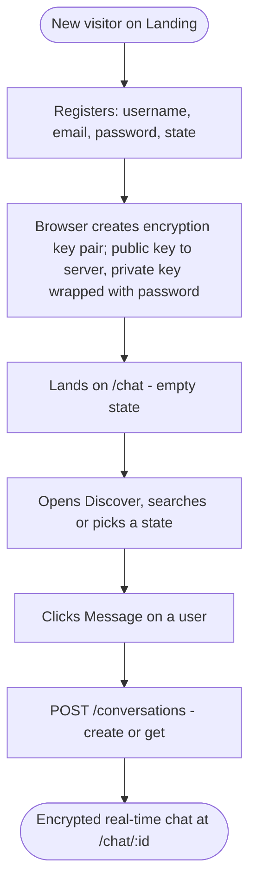
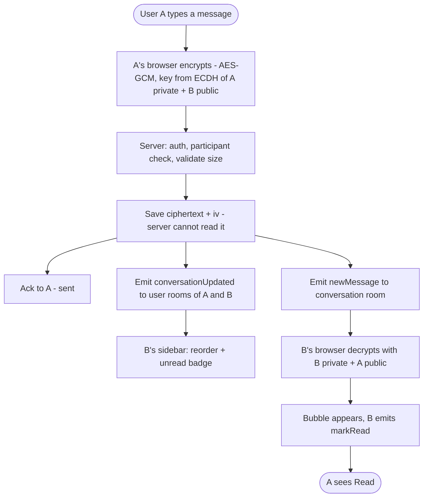
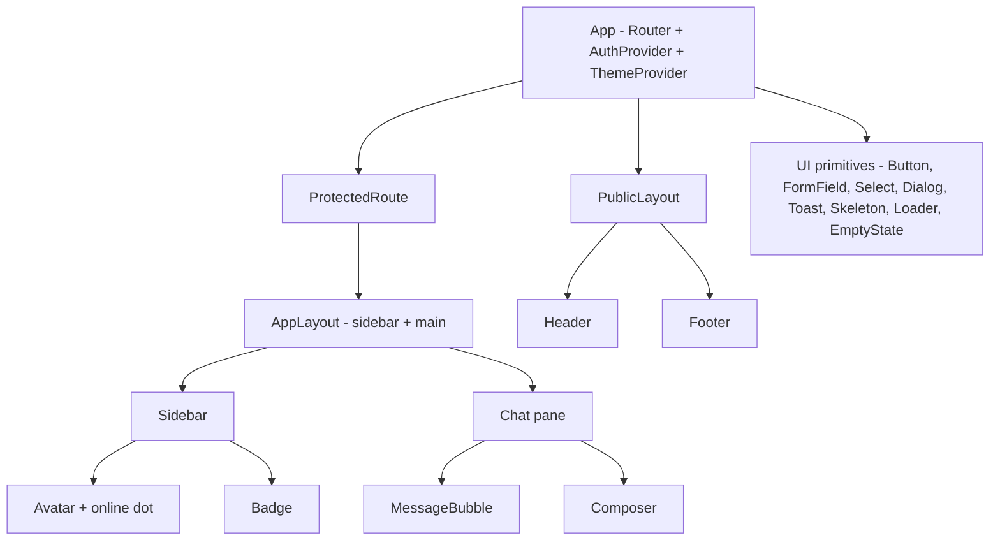
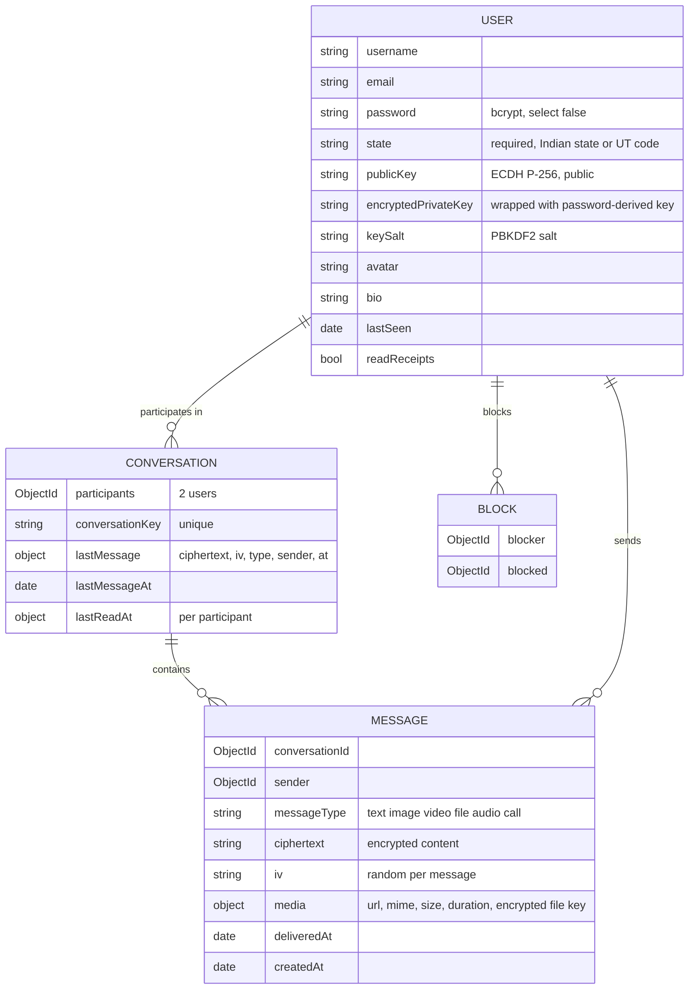

# Project Plan — OpenChat

**Status:** Approved, building · **Last updated:** 2026-09-26 · **Next step:** 32 – Notifications: tab title badge, optional browser notification (text decrypted in the browser)

> How to use this file: it is the single source of truth for what gets built and in which order.
> Work happens **one step at a time**: pick the next `todo` → build only that → test (two users) → cleanup → mark `done` → the user commits.
> If the plan changes, update this file (and `docs/blueprint.html`) first, then code.

## 1. Overview

- **What:** A real-time, open-world 1:1 communication platform. Any registered user can find and message any other user, with no friend requests.
- **For whom:** Users across India. A signature feature shows live presence per Indian state.
- **Primary goal:** Two strangers can find each other, chat in real time with **end-to-end encrypted** messages, share media and call each other.
- **Learning goal:** Build every layer properly (REST, Socket.IO, MongoDB, cryptography, WebRTC, auth, security, UI craft) and understand it.
- **Stack (existing):**
  - Client: React 19 + Vite, axios, socket.io-client.
  - Server: Express 5, Mongoose 9, Socket.IO 4, JWT in an httpOnly cookie, bcrypt.
  - Database: MongoDB.
- **Stack (planned additions, each added only in the step that needs it):**
  - React Router
  - Web Crypto API (built into the browser, no library)
  - Tailwind CSS v4 + shadcn/coss ui
  - `motion`
  - `three` + `@react-three/fiber` + `@react-three/drei`
  - Vitest + supertest
  - Cloudinary
  - helmet + express-rate-limit
- **Deadline:** none. Quality and understanding over speed.
- **Ground rules:**
  - Keep the existing Route → Controller → Service → Model layering, `AppError` plus the central error handler, and deriving identity on the server (`req.user.userId`, `socket.userId`).
  - JavaScript, no TypeScript migration.
  - No new library unless the step needs it.
  - The user makes every git commit. Agents only propose a checkpoint.

## 2. Sitemap

- `/chat`, `/chat/:conversationId`, `/discover`, `/settings` and `/u/:username` are **protected**: they redirect to `/login` without a session.
- `/login` and `/register` redirect to `/chat` if the user is already logged in.
- The call UI is an **overlay**, not a page, so a call survives navigating between chats.

## 3. Pages and sections

### Landing `/` (public)
| # | Section | Purpose | Components | Links / CTAs |
|---|---|---|---|---|
| 1 | Header | Brand, auth links, theme toggle | Header, Button, ThemeToggle | /login, /register |
| 2 | Hero | Promise and a 3D visual (live India presence globe/map, poster fallback) | Hero3D (lazy), Button | /register |
| 3 | Features | Encrypted messaging, media, calls, presence | FeatureGrid | – |
| 4 | Live presence teaser | Aggregate online counts per state | IndiaPresence (lazy) | /register |
| 5 | Footer | Links, copyright | Footer | – |

### Login `/login` and Register `/register`
| # | Section | Purpose | Components | Links / CTAs |
|---|---|---|---|---|
| 1 | Auth card | Form with inline errors, loading and disabled states. Register also asks for **Indian state** (required dropdown) | AuthLayout, FormField, Select, Button | /chat on success |
| 2 | Switch link | "No account? Register" and the reverse | Link | /register ↔ /login |

### Chat `/chat` and `/chat/:conversationId` (protected, the core app)
| # | Section | Purpose | Components | Links / CTAs |
|---|---|---|---|---|
| 1 | App shell | Two panes on desktop, one pane at a time on mobile | AppLayout | – |
| 2 | Sidebar | Own avatar/menu, search, conversation list (avatar, name, decrypted last message, time, unread badge, online dot) | Sidebar, ConversationItem, Avatar, Badge | /chat/:id, /discover, /settings |
| 3 | Chat header | Other user, online/last-seen, encryption lock, call buttons, back button on mobile | ChatHeader | call overlay, /u/:username |
| 4 | Message thread | Grouped bubbles, timestamps, date separators, receipts, media, infinite scroll up | MessageList, MessageBubble, DateDivider | – |
| 5 | Typing indicator | "typing…" for the other user | TypingIndicator | – |
| 6 | Composer | Multi-line input (Shift+Enter), send, attach, voice note | Composer, AttachButton, VoiceRecorder | – |
| 7 | Empty states | No conversation selected / no messages yet | EmptyState | /discover |

### Discover `/discover` (protected)
| # | Section | Purpose | Components | Links / CTAs |
|---|---|---|---|---|
| 1 | Search | Find users by username | SearchBar, UserCard | /u/:username, start chat |
| 2 | India presence map | Interactive 3D map with online users per state (aggregate) | IndiaPresence (R3F, lazy, 2D fallback) | filter by state |
| 3 | People in state | Users of the selected state | UserCard list | start chat |

### Profile `/u/:username` and Settings `/settings` (protected)
| # | Section | Purpose | Components |
|---|---|---|---|
| 1 | Profile | Avatar, bio, state, online status, "Message" button, key fingerprint (verify) | ProfileCard |
| 2 | Settings | Edit profile (avatar, bio, state), change password (re-wraps the encryption key), theme, privacy (read receipts on/off), blocked users, logout | SettingsForm, FormField |

## 4. Section interlink map

## 5. User flows

## 6. Shared components (built before the screens that use them)

- **Client state:** `AuthContext` for the current user, session and the unlocked private key. Theme is a small context or just a `data-theme` attribute plus `localStorage`. Chat state stays in the chat page and its hooks. No Redux/Zustand unless a real need appears.
- **One `api` axios instance** (baseURL from `VITE_API_URL`, `withCredentials`), **one `socket`** module and **one `crypto` module** (all Web Crypto calls live there, nowhere else).

## 7. Data & API map

**Key data decisions (explained when each step is built):**
- **State is chosen by the user at registration** from a fixed list of the 28 states + 8 UTs, and validated on the server against the same list. Not detected from the IP address: VPNs, mobile carrier IPs (often routed through another state) and proxies make IP-based location wrong, it needs a paid geo-IP database, and asking is more transparent for privacy.
- **Online status lives in memory, not in MongoDB.** A server-side `Map<userId, socketCount>` tracks who is online, so multiple tabs work. `lastSeen` is written to the DB only on the final disconnect. The existing `isOnline` field is dropped because it goes stale after a crash.
- **Read state is per participant on the conversation** (`lastReadAt[userId]`), not an `isRead` flag on every message. One update marks everything read; unread count = messages from the other user after my `lastReadAt`.
- **Indexes:** `Message {conversationId: 1, createdAt: -1}` and `Conversation {participants: 1, lastMessageAt: -1}`.
- **Media files live in Cloudinary** (encrypted before upload). MongoDB stores only the URL and metadata.

### End-to-end encryption design (Phase C)
- **Library:** the browser's built-in **Web Crypto API** (`crypto.subtle`). No npm package needed.
- **Keys:**
  - Each user gets an **ECDH P-256** key pair, generated in the browser at registration.
  - The **public key** is stored on the server.
  - The **private key** is encrypted (wrapped) in the browser with an AES key derived from the user's password (PBKDF2-SHA-256, 600k iterations, random salt). Only that wrapped blob goes to the server, so the server never sees the private key or the password-derived key.
- **Per conversation:** ECDH(my private, their public) → HKDF → an AES-256-GCM key. Both users derive the **same** key independently; it is never sent anywhere.
- **Per message:** AES-GCM with a fresh random 12-byte IV. The server stores `ciphertext + iv` only.
- **Login on a new device:** the server returns the wrapped private key, and the browser unwraps it with the password the user just typed.
- **Refresh:** the unwrapped key is kept as a **non-extractable** `CryptoKey` in IndexedDB, and logout deletes it.
- **Change password:** re-wrap the same private key with the new password. Old messages stay readable.
- **Honest limits (documented, revisited in step 51):**
  - **Forgot password means old messages are unreadable.** This is true E2EE: the server cannot recover the key.
  - **No forward secrecy.** Static keys, unlike Signal's Double Ratchet: if a private key leaks, past messages can be decrypted. The Double Ratchet is a possible later study step.
  - **The server serves the JavaScript.** A compromised server could ship malicious code; this is a limit of all web E2EE. A key fingerprint ("safety number") lets users verify each other.
- **Lost by design:** server-side message search, and server-generated notification text.
- **What stays plaintext on the server:** usernames, profile, state, who talks to whom, and timestamps (metadata).

### REST endpoints
| Endpoint | Method | Auth | Status | Used by |
|---|---|---|---|---|
| `/api/health` | GET | public | exists | monitoring |
| `/api/users` | POST | public | exists (needs field whitelist, state, keys) | Register |
| `/api/auth/login` | POST | public | exists (needs input validation; returns wrapped key + salt) | Login |
| `/api/auth/logout` | POST | cookie | exists | Settings / menu |
| `/api/auth/me` | GET | cookie | exists (unused by client) | AuthProvider on app load |
| `/api/users/me` | PATCH | cookie | exists | Settings |
| `/api/users/me/password` | PATCH | cookie | exists (also takes the re-wrapped key) | Settings |
| `/api/users/search?q=` | GET | cookie | planned | Discover, sidebar search |
| `/api/users/:username` | GET | cookie | planned (includes publicKey) | Profile |
| `/api/conversations` | GET | cookie | exists (public fields only since step 14; add participants' publicKey in step 17) | Sidebar |
| `/api/conversations` | POST | cookie | exists | "Message" button |
| `/api/conversations/:id/messages?before=&limit=` | GET | cookie | exists (paginated, step 13) | Message thread |
| `/api/uploads/signature` | POST | cookie | planned | Media upload |
| `/api/presence/states` | GET | cookie | planned | India map |
| `/api/blocks` | POST/DELETE/GET | cookie | planned | Settings, profile |

### Socket.IO events
Rooms: `conversationId` (existing) and `user:<userId>` (planned, joined automatically on connect). Every client → server event returns an **ack** `{ success, ... }` or `{ success: false, message }`.

| Client → Server | Server → Client | Room / target | Status |
|---|---|---|---|
| `joinConversation(id, ack)` | – | conversation | exists (ack added in step 2) |
| `leaveConversation(id)` | – | conversation | exists |
| `sendMessage({conversationId, ciphertext, iv}, ack)` | `newMessage` | conversation | exists (end-to-end encrypted since step 17) |
| – | `conversationUpdated` `{_id, lastMessage, lastMessageAt}` | user rooms of both participants | exists (step 11) |
| `typing({conversationId, isTyping})` | `typing` | conversation (except sender) | planned |
| `markRead(conversationId, ack)` | `conversationRead` `{_id}` | own user room (step 12) | exists |
| – | `messagesRead` (read receipts to the other user) | conversation | planned (step 31) |
| – | `presence:update` | contacts' user rooms | planned |
| `callUser / answerCall / iceCandidate / endCall` | same names | user rooms | planned |

## 8. Design decisions

- **Design system:** **`ui-ux-pro-max`**, chosen by the user. It is a searchable design database (styles, palettes, font pairings, UX rules). In step 19 it generates the design system with `--design-system --persist`, saved as `design-system/openchat/MASTER.md`, which every UI step then reads. It is reference data, not a separate "look", so no other direction skill is stacked on top.
- **Theme:** **light by default**, with a **dark-mode toggle**. Both themes come from the same CSS variables (`:root` + `[data-theme="dark"]`); the choice is saved in `localStorage` and the first visit follows `prefers-color-scheme`. Both themes must pass contrast checks.
- **Styling:** Tailwind CSS v4 (Vite plugin) + shadcn with **coss ui** primitives for app UI (dialogs, inputs, selects, menus, toasts). Kokonut UI only for eye-catching landing pieces.
- **Tokens:** defined once as CSS variables (colors, type scale, spacing, radius, durations `--dur-fast/base`, `--ease-out`).
- **Animation library (one):** `motion` (`motion/react`) for message enter, list reorder/layout, overlays and page transitions. No GSAP inside the app. The landing page can use GSAP only if Motion can't do a specific effect, and that needs approval.
- **3D (only where it supports the message, never in the chat hot path):**
  - Landing hero and Discover: an **interactive India presence map/globe** in React Three Fiber (`three` 0.186, fiber 9, drei 10; React 19 ✓). Base from **ThreeUI** where it fits, with `shader-glsl` / `particle-system` for glowing state points. Colors come from the theme tokens so it works in light and dark.
  - Voice call screen: an audio-reactive **Liquid Orb** (export → web), driven by WebRTC audio levels.
  - Rules: lazy-loaded, static poster/2D fallback, pause off-screen/tab hidden, DPR ≤ 2 (1.5 on mobile), `prefers-reduced-motion` respected.
- **Other kit sources:** Circle Loaders (spinners), liquid-glass (sparingly: floating call controls / mobile composer bar).
- **Skills per phase:**
  - `express-api-backend` + `owasp-security` for backend, auth and crypto
  - `mongodb-schema-design` / `mongodb-query-optimizer` for the database
  - `react-best-practices` + `composition-patterns` for React
  - `ui-ux-pro-max` + `premium-interaction-craft` for UI
  - `react-three-fiber` / `threejs-webgl` / `shader-glsl` for 3D
  - `motion-framer` for animation
  - `ponytail` to keep logic minimal
  - `post-code-cleanup` after every step
  - the `web-app-chat` checklist for chat UX

## 9. Build order

Each step is small enough to build, test with two users, and review in one go. **Phases are in order; don't start a phase while the previous one has broken steps.**

### Phase A — Stabilize the core (backend-first, no new UI)
| # | Step | Status | Done on | Notes |
|---|---|---|---|---|
| 1 | Checkpoint current uncommitted work (message input, leaveConversation, bubbles) | done | 2026-09-25 | Committed by user (`84a8b64`) |
| 2 | Harden socket handlers: try/catch, ack callbacks, content validation (string, trim, max length), one shared participant check | done | 2026-09-25 | Crash fixed; 26/26 two-user checks passed. Messages REST route now returns 400 for invalid ids |
| 3 | REST input validation + error handler: ObjectId checks, `CastError` → 400, login body check, consistent `{success:false,message}` | done | 2026-09-25 | 35/35 REST checks + 12/12 socket regression passed. JSON 404, malformed JSON → 400, `POST /api/messages` removed |
| 4 | Session restore on refresh (`/auth/me`) + logout | done | 2026-09-25 | 14/14 browser E2E checks in Edge (refresh, logout, two-user chat) |
| 5 | Reconnect: re-join room on `connect`; fix history race on fast switching | done | 2026-09-25 | 15/15 browser E2E (network drop, server restart, slow history); old code fails 8 of them. Also: offline send refused (no duplicate) |
| 6 | Client config: `VITE_API_URL`, one `api` axios instance, complete `.env.example` (server + client) | done | 2026-09-25 | 6 hardcoded URLs → `client/src/api/api.js`; `server/.env.example` + `client/.env.example`; JWT_SECRET ≥ 32 chars; README setup. E2E 14/14 + 15/15 |
| 7 | Test harness: Vitest + supertest + two-user socket test against a separate test DB | done | 2026-09-25 | `npm test`: 66 tests (auth, conversations, socket). Socket setup moved to `server/src/socket.js`. Mutation check: 3 injected security bugs all caught. Fixed Mongoose `new: true` deprecation |

### Phase B — Complete the core product flow (functional UI, minimal styling)
| # | Step | Status | Done on | Notes |
|---|---|---|---|---|
| 8 | React Router + AuthContext + protected routes (`/login`, `/register`, `/chat`, `/chat/:id`, 404) | done | 2026-09-25 | React Router 8 (declarative). `/chat/:conversationId?`, deep link kept through login, `ConversationView` keyed by id. 22/22 routing E2E; `/register` route comes with step 9 |
| 9 | Registration page + server field whitelist + **required state** (dropdown, server-validated list) | done | 2026-09-25 | `/register` with labels, field errors, double-submit guard, auto-login. State list in `shared/indian-states.js` (server + client). 70 server tests, 19/19 register E2E |
| 10 | User search API + "start conversation" | done | 2026-09-25 | `GET /api/users/search` (prefix, regex-escaped, public fields, max 20); debounced `UserSearch` in the sidebar; simultaneous conversation creates no longer 409. 101 server tests, 19/19 search E2E |
| 11 | Per-user rooms + live sidebar (`conversationUpdated`: last message, reorder) | done | 2026-09-25 | Personal room `user:<id>` on connect; summary `{_id, lastMessage, lastMessageAt}` to both participants; client merges via `useEffectEvent`, reloads for unknown conversations and after reconnect. Message list is `role="log"`. 104 server tests, 14/14 sidebar E2E (old client fails 8) |
| 12 | Unread counts (`lastReadAt` per participant) | done | 2026-09-25 | `Conversation.lastReadAt` Map; list counts in one aggregation; per-participant `unreadCount` in `conversationUpdated` (sent before `newMessage`); `markRead` → `conversationRead` to own tabs; only while the tab is visible. `Message.isRead` removed. 113 server tests, 15/15 unread E2E |
| 13 | Message pagination (load older on scroll up) + indexes | done | 2026-09-25 | Cursor pagination `?before=<messageId>&limit=` (default 50, max 100), `(createdAt, _id)` tie-break, `hasMore`; indexes `Message {conversationId, createdAt, _id}` and `Conversation {participants, lastMessageAt}` verified with explain(); client merges pages and resets on a reconnect gap. "Load older" is a button for now (auto on scroll in step 25). 128 server tests, 20/20 pagination E2E |
| 14 | Response shaping: no emails in conversation list, no internal fields | done | 2026-09-25 | `PUBLIC_USER_FIELDS` (username, avatar, state) for other users; `toJSON` safety nets drop `password` (User) and `lastReadAt` (Conversation) from every response and socket event. Privacy test scans all REST + socket payloads; old code fails it (email, hash, read times). 134 server tests |

### Phase C — End-to-end encryption for text (before UI, so everything later is built on encrypted messages)
| # | Step | Status | Done on | Notes |
|---|---|---|---|---|
| 15 | Key pair at registration: ECDH P-256 in the browser, public key + password-wrapped private key stored on server | done | 2026-09-25 | `client/src/crypto/keys.js` (Web Crypto: ECDH P-256, PBKDF2-SHA-256 600k, AES-GCM wrap, NFC passwords); server validates the SPKI curve and blob shape, `encryptedPrivateKey` is `select: false` and never in others' responses. Client unit tests (7) + 147 server tests; register E2E unlocks the browser-made key. Dev data NOT cleared (user did not confirm): legacy users have no keys, handled in step 16. Also fixed: Vitest failing on Windows lowercase drive paths (`scripts/vitest.mjs`) |
| 16 | Unlock at login, keep a non-extractable key in IndexedDB for refresh, wipe on logout, re-wrap on password change | done | 2026-09-25 | Login and `/me` return the owner's locked key; `AuthProvider.login()/unlock()`; `crypto/keyStore.js` (IndexedDB, one key, cleared on logout); unlock screen when the device has no key (URL kept) and a clear message for legacy accounts; password change requires a re-locked key (`rewrapPrivateKey`), saved atomically. Password-change UI comes in step 28. 151 server + 9 client tests, 20/20 unlock E2E |
| 17 | Encrypt/decrypt messages (ECDH → HKDF → AES-GCM); server stores only `ciphertext + iv`; sidebar preview decrypted in the browser | done | 2026-09-26 | `crypto/messages.js` (ECDH deriveBits → HKDF-SHA-256 with conversation id → AES-256-GCM, random 12-byte IV, sender id as AAD); `crypto/hooks.js` caches conversation keys; `MessageBubble` / `ConversationListItem` decrypt in the browser; server validates sizes only; `lastMessage` is `{ciphertext, iv, sender}`; public key in public fields. Legacy plain-text data is never shown or sent. 20 client + 154 server tests, 16/16 encryption E2E (DB + network have no plaintext, forged sender and tampering refused) |
| 18 | Key fingerprint ("safety number") on profile + "forgot password = old messages unreadable" handling | done | 2026-09-26 | `crypto/safetyNumber.js` (SHA-512 over both sorted public keys → 12×5 digits); "Verify encryption with …" panel above the open chat (native `
`; moves to the profile page in step 28). Clear warnings on Register and the unlock screen. 23 client tests, 10/10 safety E2E incl. a simulated man-in-the-middle (swapped public key → numbers differ, bob can't read) |

### Phase D — Design foundation + app UI (one piece at a time)
| # | Step | Status | Done on | Notes |
|---|---|---|---|---|
| 19 | Design foundation: `ui-ux-pro-max` design system → MASTER.md, Tailwind v4, shadcn/coss init, tokens, **light default + dark toggle** | done | 2026-09-26 | `design-system/openchat/MASTER.md` (generated + reviewed "OpenChat decisions": WCAG-checked light/dark tokens, fixed a failing generated button colour, Hindi-capable self-hosted fonts Poppins + Noto Sans Devanagari); Tailwind v4 (Vite plugin); shadcn with coss ui (`components.json`, only Button + Spinner kept, the rest added per step); `ThemeToggle` + no-flash inline script; interim base styles keep plain buttons/links/inputs usable. 21/21 theme E2E |
| 20 | App layout shell: 2-pane desktop, 1-pane mobile (360 → 1440px) | done | 2026-09-26 | Full-height (`h-dvh`) shell: 320px sidebar + chat pane from 768px; below that the URL picks one pane (back link + the phone's back button). Page never scrolls; messages scroll, composer stays at the bottom. Chat header with the other person's name; theme toggle in the sidebar header; `PublicLayout` for login/register/404/unlock. 23/23 layout E2E at 1280, 768, 360px |
| 21 | Sidebar + conversation items (avatar, name, last message, time, unread) | done | 2026-09-26 | `ConversationListItem`: initial-letter `Avatar`, name, en-IN time (`lib/time.js`: "10:42 am" / "Yesterday" / "Tue" / "12 Sept"), one-line truncated preview ("You:" / "No messages yet"), unread badge (99+, screen-reader "N unread"), bolder unread, highlighted active row; `ul > li` list; empty state; styled search results. All new colour pairs WCAG-checked. 31 client tests, 29/29 sidebar-items E2E |
| 22 | Chat header (incl. encryption lock indicator) | done | 2026-09-26 | Header: back (mobile), avatar, name, "End-to-end encrypted" lock button opening a coss ui `Dialog` with the safety number (3×4 grid, `<label>` + `<output>`; bottom sheet on phones; focus trapped, Esc/Done close, focus returns). The separate safety-number strip is gone. Online status and call buttons come with steps 29 and 37. 15/15 safety E2E |
| 23 | Message bubbles: grouping, timestamps, date separators | done | 2026-09-26 | `lib/timeline.js` (pure `buildTimeline`): a day heading (`<h3>`: Today / Yesterday / weekday) when the date changes; same sender within 5 min and same day = one group (tight spacing, time only on the last bubble, `<time>` with full-date title). Own bubbles right in the primary blue, theirs left in muted; sr-only "You:" / name for screen readers; `dir="auto"` (Urdu RTL), line breaks kept, long links wrap. 40 client tests, 18/18 bubbles E2E (light, dark, 360px); layout E2E caught a page-scroll bug from the sr-only label (fixed with `relative`) |
| 24 | Composer: multi-line, Shift+Enter, sending/failed state, retry | done | 2026-09-26 | Auto-growing textarea (max 160px); Enter sends, Shift+Enter = new line; Enter while an input method is composing never sends; on touch screens Enter = new line and the 44px Send button sends; character counter from 1800/2000. Outbox of unconfirmed messages: "Sending..." (only if slower than 0.5s), "Not sent" + Retry after 5s or when offline. Each message carries a `clientId` (UUID); a unique index `{sender, clientId}` makes retries idempotent, so a lost request or a lost reply never creates a duplicate. 160 server tests (+6), 35/35 composer E2E (dropped request, dropped reply, phone). Not yet: unsent messages are kept in memory only (lost on reload or switching chat) |
| 25 | Auto-scroll that never interrupts reading history + "new messages" pill | done | 2026-09-26 | Chats open at the newest message. A ResizeObserver keeps the view at the bottom while you are there (new messages, decryption, taller composer); only scrolling up leaves the bottom (the browser's own scroll anchoring never counts). While reading history nothing moves and a "N new messages" pill jumps down (instant with reduced motion); sending always jumps down; "Load older" keeps the message you were reading in place. Also fixed: the server now handles one connection's messages one at a time, in order (a quick second message could be saved first); known texts are cached per conversation key, so your own sent message no longer flashes "Decrypting...". 161 server tests (+1), 24/24 scroll E2E, 36/36 composer E2E |
| 26 | Loading / empty / error states (skeletons, Circle Loaders, toasts) | done | 2026-09-26 | Spinner while the session is checked; skeleton rows / bubbles only when loading takes over 0.5s (no flash); inline errors with "Try again" for the chat list and the history (never a misleading empty state); empty states for no chats, no chat open and an empty chat ("end-to-end encrypted, say hello"); toasts (Base UI Toast, `components/ui/toast.jsx`, aria-live, 6s, X/swipe) for background failures (load older, starting a chat); "Not connected" banner after 1s offline (`socket/useIsConnected.js`). Circle Loaders not used: the coss `Spinner` already in the design system covers the two spinners; the coss registry was unreachable, so the toast was built directly on the installed Base UI API. 34/34 states E2E |
| 27 | Auth pages UI (login/register with state picker) | done | 2026-09-26 | `AuthCard` (brand + centred card) for login, register, unlock and 404; `FormField` (visible label, hint, error, `aria-describedby`/`aria-invalid`, red border) and `PasswordInput` (show/hide, `aria-pressed`). State picker grouped into 28 states / 8 union territories (`unionTerritory` in `shared/indian-states.js`). Server errors appear under their fields and focus moves to the first wrong one; password warning shown before choosing it; coss `Button` `loading` (spinner, same width). No client-side copy of the server's rules: the server stays the single source of messages. 31/31 auth UI E2E (360px, dark, keyboard order) |
| 28 | Settings + profile page (avatar URL, bio, state, password, theme, logout) | done | 2026-09-26 | `/settings` (lazy-loaded, 7 kB): Profile (username, bio up to 160 chars, state; only changed fields are sent; server errors under their fields), Password (current/new/confirm; the private key is re-locked with the new password in the browser, a wrong current password is caught there before any request), Appearance (Light / Dark / Match device radios, `lib/theme.js` shared with the toggle), Account (email, log out). Bio is public (search shows "State · bio"). **Avatar URL dropped on purpose:** a free URL makes every viewer's browser load a file from any server (IP tracking); the server no longer accepts `avatar`, photos come with uploads in step 36. 167 server tests (+6), 32/32 settings E2E incl. new password on a new device still decrypting old messages. Main bundle 493 kB (limit 500): consider more code splitting later |

### Phase E — Real-time features (one at a time)
| # | Step | Status | Done on | Notes |
|---|---|---|---|---|
| 29 | Presence: online/offline + last seen (multi-tab aware, in memory) | done | 2026-09-26 | `server/src/presence.js`: userId → open sockets (tabs/devices), in memory; the unused `isOnline` DB field was removed (it would stay "online" after a crash). Offline only when the last tab closes, after a 5s grace period (a reload never shows as offline); then `lastSeen` is saved. `presence` events go only to people who share a conversation; `online`/`lastSeen` appear only in your own conversation list, never in search. Client: green dot on the avatar (+ "online" for screen readers), header "Online" / "Last seen today at 10:42 am" (`formatLastSeen`); the list reload after a reconnect catches up on missed changes. 171 server tests (+4), 15/15 presence E2E |
| 30 | Typing indicator (throttled, auto-stop) | done | 2026-09-26 | Server relays `typing` only into a conversation room the socket joined (the participant check happened at join: no DB query per keystroke), never back to the typist. `client/src/socket/useTyping.js`: the sender sends `true` once, again every 3s while typing, and `false` after 5s idle, on send, on empty text or on leaving the chat; the receiver hides the dots after 5s without a refresh (closed tab, lost network) or when the message arrives. Bouncing dots bubble (still with reduced motion) plus a status region "alice is typing" for screen readers. Server-side rate limits for socket events stay in step 50. 174 server tests (+3), 19/19 typing E2E |
| 31 | Delivered + read receipts (privacy toggle) | done | 2026-09-26 | No flag per message: the conversation keeps each participant's `lastDeliveredAt` next to `lastReadAt`; a message is delivered/read if created before the other person's time. Delivered when the recipient's app gets the new-message notice (`markDelivered`), when their app opens (only conversations with something new, so senders are told once), or when they read. `receipt` events go to the other participant; the list carries `receipts: { deliveredAt, readAt }`, never the raw maps. Privacy: `readReceipts` setting (Settings → Privacy, optimistic switch); off hides reads both ways (like WhatsApp), delivered stays. Ticks on my messages next to the time: ✓ sent, ✓✓ delivered, blue ✓✓ read (+ word for screen readers and tooltip). 179 server tests (+5), 18/18 receipts E2E |
| 32 | Notifications: tab title badge, optional browser notification (text decrypted in the browser) | todo | | |

### Phase F — Media sharing (encrypted)
| # | Step | Status | Done on | Notes |
|---|---|---|---|---|
| 33 | Cloudinary signed upload + images encrypted in the browser before upload (preview, progress) | todo | | Needs Cloudinary account |
| 34 | Video + file messages (size/type limits server-side) | todo | | |
| 35 | Voice notes (MediaRecorder) + audio player bubble | todo | | |
| 36 | Avatar upload (public, not encrypted) | todo | | Replaces the avatar URL left out of step 28: only images from our own storage, never arbitrary URLs |

### Phase G — Calls (WebRTC)
| # | Step | Status | Done on | Notes |
|---|---|---|---|---|
| 37 | Call signaling over Socket.IO + 1:1 voice call (STUN) | todo | | |
| 38 | Video call + controls (mute, camera, switch, end) + call overlay | todo | | |
| 39 | Call states: ringing, busy, missed, timeout → call message in chat | todo | | |
| 40 | Voice-call Liquid Orb (audio-reactive) | todo | | 3D/visual |
| 41 | TURN server for real-world networks | todo | | Needs a TURN provider |

### Phase H — India presence & discovery (signature 3D feature)
| # | Step | Status | Done on | Notes |
|---|---|---|---|---|
| 42 | Aggregated presence per state (API + live socket update, counts only) | todo | | |
| 43 | Discover page: search + people by state (2D first) | todo | | |
| 44 | Interactive 3D India map (R3F), lazy + 2D fallback, light/dark aware | todo | | |

### Phase I — Landing page & motion polish
| # | Step | Status | Done on | Notes |
|---|---|---|---|---|
| 45 | Landing page structure + content | todo | | |
| 46 | Landing 3D hero (ThreeUI / R3F / shader), poster fallback | todo | | |
| 47 | App motion polish with `motion` (messages, lists, overlays, routes) | todo | | |
| 48 | Accessibility + reduced-motion pass (both themes) | todo | | |

### Phase J — Safety, security & launch
| # | Step | Status | Done on | Notes |
|---|---|---|---|---|
| 49 | Block user (server-enforced in messages, calls, search) + report | todo | | Important for an open-world app |
| 50 | helmet, rate limits (auth + socket events), socket session expiry | todo | | |
| 51 | Security review incl. crypto (`owasp-security`); forward-secrecy study | todo | | |
| 52 | SEO basics: titles, favicon, meta, 404 | todo | | |
| 53 | Deploy: MongoDB Atlas, backend on a WebSocket-capable host, frontend host, same-site cookies, HTTPS | todo | | SPA fallback: host must serve `index.html` for all app paths (e.g. `/chat/:id`). Indexes: Mongoose builds them on start (autoIndex); in production create them once at deploy and turn autoIndex off |
| 54 | `launch-readiness-audit` | todo | | |

Status values: `todo` · `in progress` · `done` · `blocked (<reason>)`

## 10. Open questions & risks

1. **Cloudinary and TURN accounts:** free tiers are enough for development. Needed before steps 33 and 41.
2. **Risk, cookies in production:** `sameSite: strict` only works if frontend and API are on the same site (e.g. `app.domain.com` + `api.domain.com`). Decide the hosting setup before step 53.
3. **Risk, WebRTC across networks:** without a TURN server, many calls (mobile data, strict NAT) will fail.
4. **E2EE and forgotten passwords:** a password reset cannot recover old messages. The UI says so on Register and the unlock screen (step 18); there is no password-reset flow yet.
6. **Key-change warning (step 51):** users are only protected from a malicious server if they compare safety numbers. A "this person's key changed" warning (remember each contact's key on first use) would catch it automatically.
5. **Existing dev data:** user chose to clear it (option b, 2026-09-25). The delete was blocked by the agent's permission rules, so the user runs it themselves. Until then, old accounts log in to a clear "Encryption is not set up" screen.

**Resolved (2026-09-25):**
- Design: `ui-ux-pro-max`, light default + dark toggle.
- State: asked at registration (required).
- Text: proper end-to-end encryption.
- Agent Kit moved to the project root.
- Username rules: 3–30 chars, lowercase letters/numbers/`.`/`_`, starts with a letter or number, no trailing or double dot, reserved names (admin, support, openchat, …) blocked.
- Password policy (OWASP ASVS 5.0): 8–64 characters (max 72 bytes, the bcrypt limit), any characters, no composition rules, common passwords blocked. The built-in list is small; a larger breached-password list is part of step 51.
