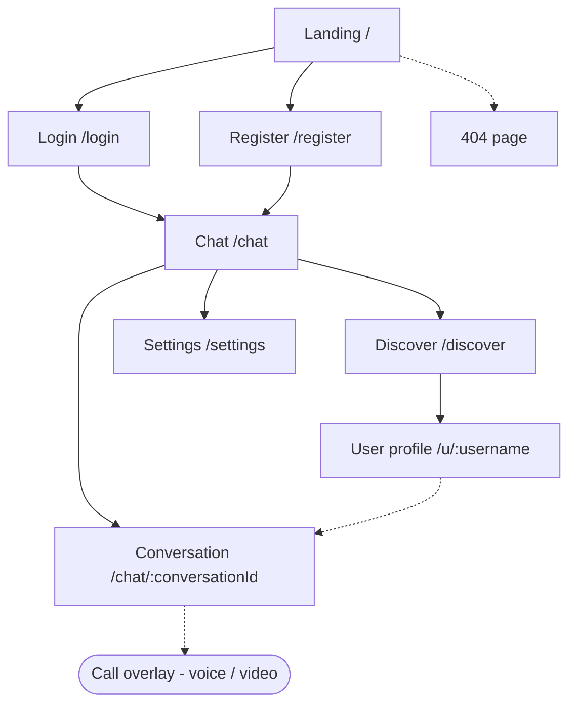
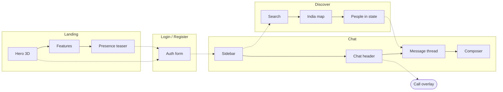
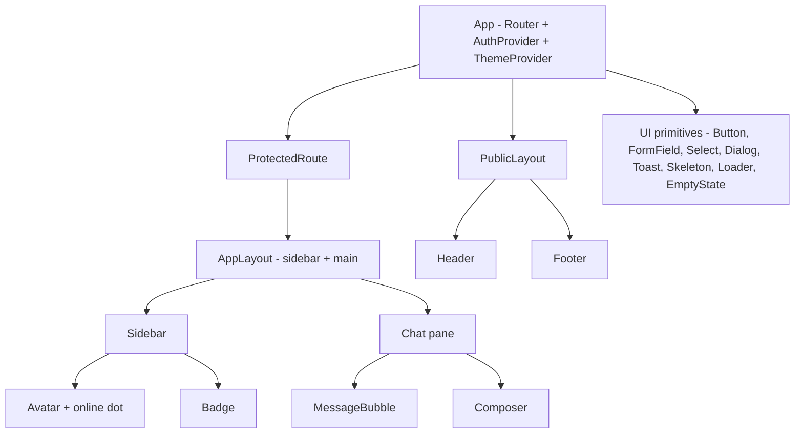
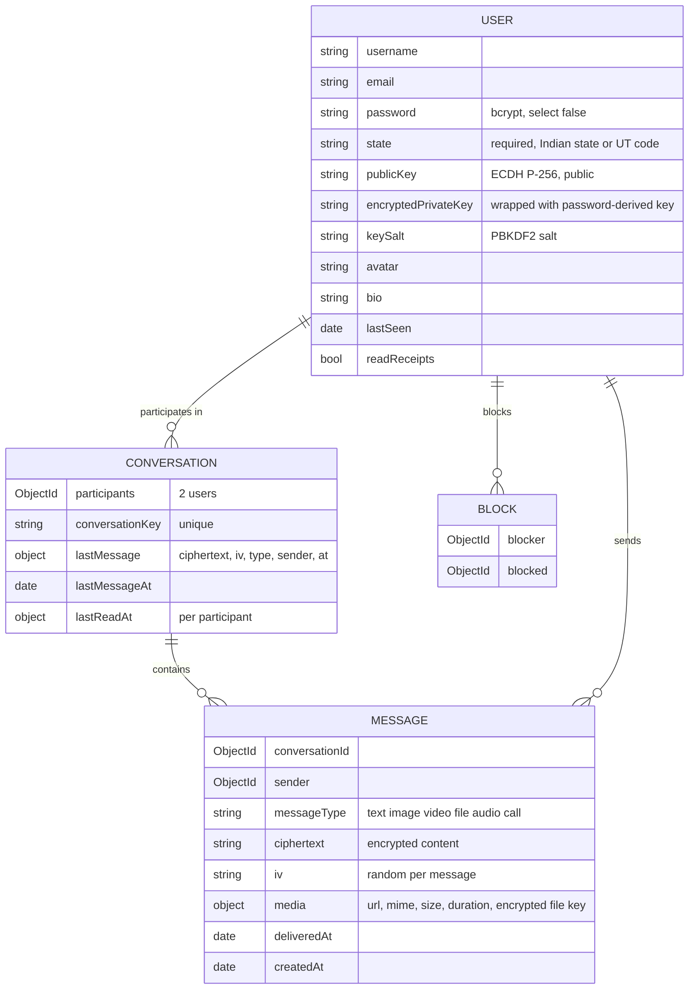

# Project Plan — OpenChat

**Status:** Approved, building · **Last updated:** 2026-09-28 · **Next step:** 61 – calls keep going when the app is minimised (Phase K, v2); step 60 goes live once BREVO_API_KEY + EMAIL_FROM are on Render; step 54 runs after Phase K

> How to use this file: it is the single source of truth for what gets built and in which order.
> Work happens **one step at a time**: pick the next `todo` → build only that → test (two users) → cleanup → mark `done` → the user commits.
> If the plan changes, update this file (and `docs/blueprint.html`) first, then code.

## 1. Overview

- **What:** A real-time, open-world 1:1 communication platform. Any registered user can find and message any other user, with no friend requests.
- **For whom:** Users across India. A signature feature shows live presence per Indian state.
- **Primary goal:** Two strangers can find each other, chat in real time with **end-to-end encrypted** messages, share media and call each other.
- **Learning goal:** Build every layer properly (REST, Socket.IO, MongoDB, cryptography, WebRTC, auth, security, UI craft) and understand it.
- **Stack (existing):**
  - Client: React 19 + Vite, axios, socket.io-client.
  - Server: Express 5, Mongoose 9, Socket.IO 4, JWT in an httpOnly cookie, bcrypt.
  - Database: MongoDB.
- **Stack (planned additions, each added only in the step that needs it):**
  - React Router
  - Web Crypto API (built into the browser, no library)
  - Tailwind CSS v4 + shadcn/coss ui
  - `motion`
  - `three` + `@react-three/fiber` + `@react-three/drei`
  - Vitest + supertest
  - Cloudinary
  - helmet + express-rate-limit
- **Deadline:** none. Quality and understanding over speed.
- **Ground rules:**
  - Keep the existing Route → Controller → Service → Model layering, `AppError` plus the central error handler, and deriving identity on the server (`req.user.userId`, `socket.userId`).
  - JavaScript, no TypeScript migration.
  - No new library unless the step needs it.
  - The user makes every git commit. Agents only propose a checkpoint.

## 2. Sitemap

- `/chat`, `/chat/:conversationId`, `/discover`, `/settings` and `/u/:username` are **protected**: they redirect to `/login` without a session.
- `/login` and `/register` redirect to `/chat` if the user is already logged in.
- The call UI is an **overlay**, not a page, so a call survives navigating between chats.

## 3. Pages and sections

### Landing `/` (public)
| # | Section | Purpose | Components | Links / CTAs |
|---|---|---|---|---|
| 1 | Header | Brand, auth links, theme toggle | Header, Button, ThemeToggle | /login, /register |
| 2 | Hero | Promise, an example chat as the poster and the 3D "encrypted orb" behind it (large screens only) | HeroOrb (lazy), Button | /register |
| 3 | Features | Encrypted messaging, media, calls, presence | FeatureGrid | – |
| 4 | Live presence teaser | Aggregate online counts per state | LandingPresence | /register |
| 5 | Footer | Links, copyright | Footer | – |

### Login `/login` and Register `/register`
| # | Section | Purpose | Components | Links / CTAs |
|---|---|---|---|---|
| 1 | Auth card | Form with inline errors, loading and disabled states. Register also asks for **Indian state** (required dropdown) | AuthLayout, FormField, Select, Button | /chat on success |
| 2 | Switch link | "No account? Register" and the reverse | Link | /register ↔ /login |

### Chat `/chat` and `/chat/:conversationId` (protected, the core app)
| # | Section | Purpose | Components | Links / CTAs |
|---|---|---|---|---|
| 1 | App shell | Two panes on desktop, one pane at a time on mobile | AppLayout | – |
| 2 | Sidebar | Own avatar/menu, search, conversation list (avatar, name, decrypted last message, time, unread badge, online dot) | Sidebar, ConversationItem, Avatar, Badge | /chat/:id, /discover, /settings |
| 3 | Chat header | Other user, online/last-seen, encryption lock, call buttons, back button on mobile | ChatHeader | call overlay, /u/:username |
| 4 | Message thread | Grouped bubbles, timestamps, date separators, receipts, media, infinite scroll up | MessageList, MessageBubble, DateDivider | – |
| 5 | Typing indicator | "typing…" for the other user | TypingIndicator | – |
| 6 | Composer | Multi-line input (Shift+Enter), send, attach, voice note | Composer, AttachButton, VoiceRecorder | – |
| 7 | Empty states | No conversation selected / no messages yet | EmptyState | /discover |

### Discover `/discover` (protected)
| # | Section | Purpose | Components | Links / CTAs |
|---|---|---|---|---|
| 1 | Search | Find users by username | SearchBar, UserCard | /u/:username, start chat |
| 2 | India presence map | Official Survey of India map, states tinted by online count (aggregate), popup with people next to the chosen state; desktop fits one screen | IndiaMap (SVG, lazy), MapPopup | filter by state |
| 3 | People in state | Users of the selected state | UserCard list | start chat |

### Profile `/u/:username` and Settings `/settings` (protected)
| # | Section | Purpose | Components |
|---|---|---|---|
| 1 | Profile | Avatar, bio, state, online status, "Message" button, key fingerprint (verify) | ProfileCard |
| 2 | Settings | Edit profile (avatar, bio, state), change password (re-wraps the encryption key), theme, privacy (read receipts on/off), blocked users, logout | SettingsForm, FormField |

## 4. Section interlink map

## 5. User flows

## 6. Shared components (built before the screens that use them)

- **Client state:** `AuthContext` for the current user, session and the unlocked private key. Theme is a small context or just a `data-theme` attribute plus `localStorage`. Chat state stays in the chat page and its hooks. No Redux/Zustand unless a real need appears.
- **One `api` axios instance** (baseURL from `VITE_API_URL`, `withCredentials`), **one `socket`** module and **one `crypto` module** (all Web Crypto calls live there, nowhere else).

## 7. Data & API map

**Key data decisions (explained when each step is built):**
- **State is chosen by the user at registration** from a fixed list of the 28 states + 8 UTs, and validated on the server against the same list. Not detected from the IP address: VPNs, mobile carrier IPs (often routed through another state) and proxies make IP-based location wrong, it needs a paid geo-IP database, and asking is more transparent for privacy.
- **Online status lives in memory, not in MongoDB.** A server-side `Map<userId, socketCount>` tracks who is online, so multiple tabs work. `lastSeen` is written to the DB only on the final disconnect. The existing `isOnline` field is dropped because it goes stale after a crash.
- **Read state is per participant on the conversation** (`lastReadAt[userId]`), not an `isRead` flag on every message. One update marks everything read; unread count = messages from the other user after my `lastReadAt`.
- **Indexes:** `Message {conversationId: 1, createdAt: -1}` and `Conversation {participants: 1, lastMessageAt: -1}`.
- **Media files live in Cloudinary** (encrypted before upload). MongoDB stores only the URL and metadata.

### End-to-end encryption design (Phase C)
- **Library:** the browser's built-in **Web Crypto API** (`crypto.subtle`). No npm package needed.
- **Keys:**
  - Each user gets an **ECDH P-256** key pair, generated in the browser at registration.
  - The **public key** is stored on the server.
  - The **private key** is encrypted (wrapped) in the browser with an AES key derived from the user's password (PBKDF2-SHA-256, 600k iterations, random salt). Only that wrapped blob goes to the server, so the server never sees the private key or the password-derived key.
- **Per conversation:** ECDH(my private, their public) → HKDF → an AES-256-GCM key. Both users derive the **same** key independently; it is never sent anywhere.
- **Per message:** AES-GCM with a fresh random 12-byte IV. The server stores `ciphertext + iv` only.
- **Login on a new device:** the server returns the wrapped private key, and the browser unwraps it with the password the user just typed.
- **Refresh:** the unwrapped key is kept as a **non-extractable** `CryptoKey` in IndexedDB, and logout deletes it.
- **Change password:** re-wrap the same private key with the new password. Old messages stay readable.
- **Honest limits (documented, revisited in step 51):**
  - **Forgot password means old messages are unreadable.** This is true E2EE: the server cannot recover the key.
  - **No forward secrecy.** Static keys, unlike Signal's Double Ratchet: if a private key leaks, past messages can be decrypted. The Double Ratchet is a possible later study step.
  - **The server serves the JavaScript.** A compromised server could ship malicious code; this is a limit of all web E2EE. A key fingerprint ("safety number") lets users verify each other.
- **Lost by design:** server-side message search, and server-generated notification text.
- **What stays plaintext on the server:** usernames, profile, state, who talks to whom, and timestamps (metadata).

### REST endpoints
| Endpoint | Method | Auth | Status | Used by |
|---|---|---|---|---|
| `/api/health` | GET | public | exists | monitoring |
| `/api/users` | POST | public | exists (needs field whitelist, state, keys) | Register |
| `/api/auth/login` | POST | public | exists (needs input validation; returns wrapped key + salt) | Login |
| `/api/auth/logout` | POST | cookie | exists | Settings / menu |
| `/api/auth/me` | GET | cookie | exists (unused by client) | AuthProvider on app load |
| `/api/users/me` | PATCH | cookie | exists | Settings |
| `/api/users/me/password` | PATCH | cookie | exists (also takes the re-wrapped key) | Settings |
| `/api/users/search?q=` | GET | cookie | planned | Discover, sidebar search |
| `/api/users/:username` | GET | cookie | done (public fields incl. publicKey; exact match, 404 if unknown) | Profile |
| `/api/conversations` | GET | cookie | exists (public fields only since step 14; add participants' publicKey in step 17) | Sidebar |
| `/api/conversations` | POST | cookie | exists | "Message" button |
| `/api/conversations/:id/messages?before=&limit=` | GET | cookie | exists (paginated, step 13) | Message thread |
| `/api/uploads/signature` | POST | cookie | planned | Media upload |
| `/api/presence/states` | GET | cookie | planned | India map |
| `/api/blocks` | POST/DELETE/GET | cookie | planned | Settings, profile |

### Socket.IO events
Rooms: `conversationId` (existing) and `user:<userId>` (planned, joined automatically on connect). Every client → server event returns an **ack** `{ success, ... }` or `{ success: false, message }`.

| Client → Server | Server → Client | Room / target | Status |
|---|---|---|---|
| `joinConversation(id, ack)` | – | conversation | exists (ack added in step 2) |
| `leaveConversation(id)` | – | conversation | exists |
| `sendMessage({conversationId, ciphertext, iv}, ack)` | `newMessage` | conversation | exists (end-to-end encrypted since step 17) |
| – | `conversationUpdated` `{_id, lastMessage, lastMessageAt}` | user rooms of both participants | exists (step 11) |
| `typing({conversationId, isTyping})` | `typing` | conversation (except sender) | planned |
| `markRead(conversationId, ack)` | `conversationRead` `{_id}` | own user room (step 12) | exists |
| – | `messagesRead` (read receipts to the other user) | conversation | planned (step 31) |
| – | `presence:update` | contacts' user rooms | planned |
| `callUser / answerCall / iceCandidate / endCall` | same names | user rooms | planned |

## 8. Design decisions

- **Look (since 2026-09-27): "Ink & Paper"** — chosen by the user from two rounds of directions on a design canvas (redesign phase I2): paper and ink, one sindoor-red accent, DM Serif Display / Hanken Grotesk / JetBrains Mono (+ Devanagari faces), paper grain. The details and contrast table are in `design-system/openchat/MASTER.md`; the lines below are the original decisions, kept for history where they differ.
- **Design system:** **`ui-ux-pro-max`**, chosen by the user. It is a searchable design database (styles, palettes, font pairings, UX rules). In step 19 it generates the design system with `--design-system --persist`, saved as `design-system/openchat/MASTER.md`, which every UI step then reads. It is reference data, not a separate "look", so no other direction skill is stacked on top.
- **Theme:** **light by default**, with a **dark-mode toggle**. Both themes come from the same CSS variables (`:root` + `[data-theme="dark"]`); the choice is saved in `localStorage` and the first visit follows `prefers-color-scheme`. Both themes must pass contrast checks.
- **Styling:** Tailwind CSS v4 (Vite plugin) + shadcn with **coss ui** primitives for app UI (dialogs, inputs, selects, menus, toasts). Kokonut UI only for eye-catching landing pieces.
- **Tokens:** defined once as CSS variables (colors, type scale, spacing, radius, durations `--dur-fast/base`, `--ease-out`).
- **Animation library (one):** `motion` (`motion/react`) for message enter, list reorder/layout, overlays and page transitions. No GSAP inside the app. The landing page can use GSAP only if Motion can't do a specific effect, and that needs approval. **Approved by the user in R4:** GSAP + Lenis on the landing page only (smooth scrolling and scroll reveals).
- **3D (only where it supports the message, never in the chat hot path):**
  - **No 3D libraries any more (user's decision in R4, for performance):** the landing orb (step 46) and a Spline scene were removed; Discover uses a flat SVG map of India (Survey of India boundaries). The landing uses GSAP + Lenis for light scroll motion, loaded only there.
  - Voice call screen: an audio-reactive **Liquid Orb** (export → web), driven by WebRTC audio levels.
  - Rules: lazy-loaded, static poster/2D fallback, pause off-screen/tab hidden, DPR ≤ 2 (1.5 on mobile), `prefers-reduced-motion` respected.
- **Other kit sources:** Circle Loaders (spinners), liquid-glass (sparingly: floating call controls / mobile composer bar).
- **Skills per phase:**
  - `express-api-backend` + `owasp-security` for backend, auth and crypto
  - `mongodb-schema-design` / `mongodb-query-optimizer` for the database
  - `react-best-practices` + `composition-patterns` for React
  - `ui-ux-pro-max` + `premium-interaction-craft` for UI
  - `react-three-fiber` / `threejs-webgl` / `shader-glsl` for 3D
  - `motion-framer` for animation
  - `ponytail` to keep logic minimal
  - `post-code-cleanup` after every step
  - the `web-app-chat` checklist for chat UX

## 9. Build order

Each step is small enough to build, test with two users, and review in one go. **Phases are in order; don't start a phase while the previous one has broken steps.**

### Phase A — Stabilize the core (backend-first, no new UI)
| # | Step | Status | Done on | Notes |
|---|---|---|---|---|
| 1 | Checkpoint current uncommitted work (message input, leaveConversation, bubbles) | done | 2026-09-25 | Committed by user (`84a8b64`) |
| 2 | Harden socket handlers: try/catch, ack callbacks, content validation (string, trim, max length), one shared participant check | done | 2026-09-25 | Crash fixed; 26/26 two-user checks passed. Messages REST route now returns 400 for invalid ids |
| 3 | REST input validation + error handler: ObjectId checks, `CastError` → 400, login body check, consistent `{success:false,message}` | done | 2026-09-25 | 35/35 REST checks + 12/12 socket regression passed. JSON 404, malformed JSON → 400, `POST /api/messages` removed |
| 4 | Session restore on refresh (`/auth/me`) + logout | done | 2026-09-25 | 14/14 browser E2E checks in Edge (refresh, logout, two-user chat) |
| 5 | Reconnect: re-join room on `connect`; fix history race on fast switching | done | 2026-09-25 | 15/15 browser E2E (network drop, server restart, slow history); old code fails 8 of them. Also: offline send refused (no duplicate) |
| 6 | Client config: `VITE_API_URL`, one `api` axios instance, complete `.env.example` (server + client) | done | 2026-09-25 | 6 hardcoded URLs → `client/src/api/api.js`; `server/.env.example` + `client/.env.example`; JWT_SECRET ≥ 32 chars; README setup. E2E 14/14 + 15/15 |
| 7 | Test harness: Vitest + supertest + two-user socket test against a separate test DB | done | 2026-09-25 | `npm test`: 66 tests (auth, conversations, socket). Socket setup moved to `server/src/socket.js`. Mutation check: 3 injected security bugs all caught. Fixed Mongoose `new: true` deprecation |

### Phase B — Complete the core product flow (functional UI, minimal styling)
| # | Step | Status | Done on | Notes |
|---|---|---|---|---|
| 8 | React Router + AuthContext + protected routes (`/login`, `/register`, `/chat`, `/chat/:id`, 404) | done | 2026-09-25 | React Router 8 (declarative). `/chat/:conversationId?`, deep link kept through login, `ConversationView` keyed by id. 22/22 routing E2E; `/register` route comes with step 9 |
| 9 | Registration page + server field whitelist + **required state** (dropdown, server-validated list) | done | 2026-09-25 | `/register` with labels, field errors, double-submit guard, auto-login. State list in `shared/indian-states.js` (server + client). 70 server tests, 19/19 register E2E |
| 10 | User search API + "start conversation" | done | 2026-09-25 | `GET /api/users/search` (prefix, regex-escaped, public fields, max 20); debounced `UserSearch` in the sidebar; simultaneous conversation creates no longer 409. 101 server tests, 19/19 search E2E |
| 11 | Per-user rooms + live sidebar (`conversationUpdated`: last message, reorder) | done | 2026-09-25 | Personal room `user:<id>` on connect; summary `{_id, lastMessage, lastMessageAt}` to both participants; client merges via `useEffectEvent`, reloads for unknown conversations and after reconnect. Message list is `role="log"`. 104 server tests, 14/14 sidebar E2E (old client fails 8) |
| 12 | Unread counts (`lastReadAt` per participant) | done | 2026-09-25 | `Conversation.lastReadAt` Map; list counts in one aggregation; per-participant `unreadCount` in `conversationUpdated` (sent before `newMessage`); `markRead` → `conversationRead` to own tabs; only while the tab is visible. `Message.isRead` removed. 113 server tests, 15/15 unread E2E |
| 13 | Message pagination (load older on scroll up) + indexes | done | 2026-09-25 | Cursor pagination `?before=<messageId>&limit=` (default 50, max 100), `(createdAt, _id)` tie-break, `hasMore`; indexes `Message {conversationId, createdAt, _id}` and `Conversation {participants, lastMessageAt}` verified with explain(); client merges pages and resets on a reconnect gap. "Load older" is a button for now (auto on scroll in step 25). 128 server tests, 20/20 pagination E2E |
| 14 | Response shaping: no emails in conversation list, no internal fields | done | 2026-09-25 | `PUBLIC_USER_FIELDS` (username, avatar, state) for other users; `toJSON` safety nets drop `password` (User) and `lastReadAt` (Conversation) from every response and socket event. Privacy test scans all REST + socket payloads; old code fails it (email, hash, read times). 134 server tests |

### Phase C — End-to-end encryption for text (before UI, so everything later is built on encrypted messages)
| # | Step | Status | Done on | Notes |
|---|---|---|---|---|
| 15 | Key pair at registration: ECDH P-256 in the browser, public key + password-wrapped private key stored on server | done | 2026-09-25 | `client/src/crypto/keys.js` (Web Crypto: ECDH P-256, PBKDF2-SHA-256 600k, AES-GCM wrap, NFC passwords); server validates the SPKI curve and blob shape, `encryptedPrivateKey` is `select: false` and never in others' responses. Client unit tests (7) + 147 server tests; register E2E unlocks the browser-made key. Dev data NOT cleared (user did not confirm): legacy users have no keys, handled in step 16. Also fixed: Vitest failing on Windows lowercase drive paths (`scripts/vitest.mjs`) |
| 16 | Unlock at login, keep a non-extractable key in IndexedDB for refresh, wipe on logout, re-wrap on password change | done | 2026-09-25 | Login and `/me` return the owner's locked key; `AuthProvider.login()/unlock()`; `crypto/keyStore.js` (IndexedDB, one key, cleared on logout); unlock screen when the device has no key (URL kept) and a clear message for legacy accounts; password change requires a re-locked key (`rewrapPrivateKey`), saved atomically. Password-change UI comes in step 28. 151 server + 9 client tests, 20/20 unlock E2E |
| 17 | Encrypt/decrypt messages (ECDH → HKDF → AES-GCM); server stores only `ciphertext + iv`; sidebar preview decrypted in the browser | done | 2026-09-26 | `crypto/messages.js` (ECDH deriveBits → HKDF-SHA-256 with conversation id → AES-256-GCM, random 12-byte IV, sender id as AAD); `crypto/hooks.js` caches conversation keys; `MessageBubble` / `ConversationListItem` decrypt in the browser; server validates sizes only; `lastMessage` is `{ciphertext, iv, sender}`; public key in public fields. Legacy plain-text data is never shown or sent. 20 client + 154 server tests, 16/16 encryption E2E (DB + network have no plaintext, forged sender and tampering refused) |
| 18 | Key fingerprint ("safety number") on profile + "forgot password = old messages unreadable" handling | done | 2026-09-26 | `crypto/safetyNumber.js` (SHA-512 over both sorted public keys → 12×5 digits); "Verify encryption with …" panel above the open chat (native `
`; moves to the profile page in step 28). Clear warnings on Register and the unlock screen. 23 client tests, 10/10 safety E2E incl. a simulated man-in-the-middle (swapped public key → numbers differ, bob can't read) |

### Phase D — Design foundation + app UI (one piece at a time)
| # | Step | Status | Done on | Notes |
|---|---|---|---|---|
| 19 | Design foundation: `ui-ux-pro-max` design system → MASTER.md, Tailwind v4, shadcn/coss init, tokens, **light default + dark toggle** | done | 2026-09-26 | `design-system/openchat/MASTER.md` (generated + reviewed "OpenChat decisions": WCAG-checked light/dark tokens, fixed a failing generated button colour, Hindi-capable self-hosted fonts Poppins + Noto Sans Devanagari); Tailwind v4 (Vite plugin); shadcn with coss ui (`components.json`, only Button + Spinner kept, the rest added per step); `ThemeToggle` + no-flash inline script; interim base styles keep plain buttons/links/inputs usable. 21/21 theme E2E |
| 20 | App layout shell: 2-pane desktop, 1-pane mobile (360 → 1440px) | done | 2026-09-26 | Full-height (`h-dvh`) shell: 320px sidebar + chat pane from 768px; below that the URL picks one pane (back link + the phone's back button). Page never scrolls; messages scroll, composer stays at the bottom. Chat header with the other person's name; theme toggle in the sidebar header; `PublicLayout` for login/register/404/unlock. 23/23 layout E2E at 1280, 768, 360px |
| 21 | Sidebar + conversation items (avatar, name, last message, time, unread) | done | 2026-09-26 | `ConversationListItem`: initial-letter `Avatar`, name, en-IN time (`lib/time.js`: "10:42 am" / "Yesterday" / "Tue" / "12 Sept"), one-line truncated preview ("You:" / "No messages yet"), unread badge (99+, screen-reader "N unread"), bolder unread, highlighted active row; `ul > li` list; empty state; styled search results. All new colour pairs WCAG-checked. 31 client tests, 29/29 sidebar-items E2E |
| 22 | Chat header (incl. encryption lock indicator) | done | 2026-09-26 | Header: back (mobile), avatar, name, "End-to-end encrypted" lock button opening a coss ui `Dialog` with the safety number (3×4 grid, `<label>` + `<output>`; bottom sheet on phones; focus trapped, Esc/Done close, focus returns). The separate safety-number strip is gone. Online status and call buttons come with steps 29 and 37. 15/15 safety E2E |
| 23 | Message bubbles: grouping, timestamps, date separators | done | 2026-09-26 | `lib/timeline.js` (pure `buildTimeline`): a day heading (`<h3>`: Today / Yesterday / weekday) when the date changes; same sender within 5 min and same day = one group (tight spacing, time only on the last bubble, `<time>` with full-date title). Own bubbles right in the primary blue, theirs left in muted; sr-only "You:" / name for screen readers; `dir="auto"` (Urdu RTL), line breaks kept, long links wrap. 40 client tests, 18/18 bubbles E2E (light, dark, 360px); layout E2E caught a page-scroll bug from the sr-only label (fixed with `relative`) |
| 24 | Composer: multi-line, Shift+Enter, sending/failed state, retry | done | 2026-09-26 | Auto-growing textarea (max 160px); Enter sends, Shift+Enter = new line; Enter while an input method is composing never sends; on touch screens Enter = new line and the 44px Send button sends; character counter from 1800/2000. Outbox of unconfirmed messages: "Sending..." (only if slower than 0.5s), "Not sent" + Retry after 5s or when offline. Each message carries a `clientId` (UUID); a unique index `{sender, clientId}` makes retries idempotent, so a lost request or a lost reply never creates a duplicate. 160 server tests (+6), 35/35 composer E2E (dropped request, dropped reply, phone). Not yet: unsent messages are kept in memory only (lost on reload or switching chat) |
| 25 | Auto-scroll that never interrupts reading history + "new messages" pill | done | 2026-09-26 | Chats open at the newest message. A ResizeObserver keeps the view at the bottom while you are there (new messages, decryption, taller composer); only scrolling up leaves the bottom (the browser's own scroll anchoring never counts). While reading history nothing moves and a "N new messages" pill jumps down (instant with reduced motion); sending always jumps down; "Load older" keeps the message you were reading in place. Also fixed: the server now handles one connection's messages one at a time, in order (a quick second message could be saved first); known texts are cached per conversation key, so your own sent message no longer flashes "Decrypting...". 161 server tests (+1), 24/24 scroll E2E, 36/36 composer E2E |
| 26 | Loading / empty / error states (skeletons, Circle Loaders, toasts) | done | 2026-09-26 | Spinner while the session is checked; skeleton rows / bubbles only when loading takes over 0.5s (no flash); inline errors with "Try again" for the chat list and the history (never a misleading empty state); empty states for no chats, no chat open and an empty chat ("end-to-end encrypted, say hello"); toasts (Base UI Toast, `components/ui/toast.jsx`, aria-live, 6s, X/swipe) for background failures (load older, starting a chat); "Not connected" banner after 1s offline (`socket/useIsConnected.js`). Circle Loaders not used: the coss `Spinner` already in the design system covers the two spinners; the coss registry was unreachable, so the toast was built directly on the installed Base UI API. 34/34 states E2E |
| 27 | Auth pages UI (login/register with state picker) | done | 2026-09-26 | `AuthCard` (brand + centred card) for login, register, unlock and 404; `FormField` (visible label, hint, error, `aria-describedby`/`aria-invalid`, red border) and `PasswordInput` (show/hide, `aria-pressed`). State picker grouped into 28 states / 8 union territories (`unionTerritory` in `shared/indian-states.js`). Server errors appear under their fields and focus moves to the first wrong one; password warning shown before choosing it; coss `Button` `loading` (spinner, same width). No client-side copy of the server's rules: the server stays the single source of messages. 31/31 auth UI E2E (360px, dark, keyboard order) |
| 28 | Settings + profile page (avatar URL, bio, state, password, theme, logout) | done | 2026-09-26 | `/settings` (lazy-loaded, 7 kB): Profile (username, bio up to 160 chars, state; only changed fields are sent; server errors under their fields), Password (current/new/confirm; the private key is re-locked with the new password in the browser, a wrong current password is caught there before any request), Appearance (Light / Dark / Match device radios, `lib/theme.js` shared with the toggle), Account (email, log out). Bio is public (search shows "State · bio"). **Avatar URL dropped on purpose:** a free URL makes every viewer's browser load a file from any server (IP tracking); the server no longer accepts `avatar`, photos come with uploads in step 36. 167 server tests (+6), 32/32 settings E2E incl. new password on a new device still decrypting old messages. Main bundle 493 kB (limit 500): consider more code splitting later |

### Phase E — Real-time features (one at a time)
| # | Step | Status | Done on | Notes |
|---|---|---|---|---|
| 29 | Presence: online/offline + last seen (multi-tab aware, in memory) | done | 2026-09-26 | `server/src/presence.js`: userId → open sockets (tabs/devices), in memory; the unused `isOnline` DB field was removed (it would stay "online" after a crash). Offline only when the last tab closes, after a 5s grace period (a reload never shows as offline); then `lastSeen` is saved. `presence` events go only to people who share a conversation; `online`/`lastSeen` appear only in your own conversation list, never in search. Client: green dot on the avatar (+ "online" for screen readers), header "Online" / "Last seen today at 10:42 am" (`formatLastSeen`); the list reload after a reconnect catches up on missed changes. 171 server tests (+4), 15/15 presence E2E |
| 30 | Typing indicator (throttled, auto-stop) | done | 2026-09-26 | Server relays `typing` only into a conversation room the socket joined (the participant check happened at join: no DB query per keystroke), never back to the typist. `client/src/socket/useTyping.js`: the sender sends `true` once, again every 3s while typing, and `false` after 5s idle, on send, on empty text or on leaving the chat; the receiver hides the dots after 5s without a refresh (closed tab, lost network) or when the message arrives. Bouncing dots bubble (still with reduced motion) plus a status region "alice is typing" for screen readers. Server-side rate limits for socket events stay in step 50. 174 server tests (+3), 19/19 typing E2E |
| 31 | Delivered + read receipts (privacy toggle) | done | 2026-09-26 | No flag per message: the conversation keeps each participant's `lastDeliveredAt` next to `lastReadAt`; a message is delivered/read if created before the other person's time. Delivered when the recipient's app gets the new-message notice (`markDelivered`), when their app opens (only conversations with something new, so senders are told once), or when they read. `receipt` events go to the other participant; the list carries `receipts: { deliveredAt, readAt }`, never the raw maps. Privacy: `readReceipts` setting (Settings → Privacy, optimistic switch); off hides reads both ways (like WhatsApp), delivered stays. Ticks on my messages next to the time: ✓ sent, ✓✓ delivered, blue ✓✓ read (+ word for screen readers and tooltip). 179 server tests (+5), 18/18 receipts E2E |
| 32 | Notifications: tab title badge, optional browser notification (text decrypted in the browser) | done | 2026-09-26 | Tab title "(3) OpenChat" from the unread counts. Settings → Notifications (per device, localStorage): off by default, the browser asks for permission only when the switch is turned on; blocked permission and unsupported browsers are explained. A notification only when the window isn't focused; sender name + text decrypted in the browser, or just "New message" ("Show message text" off); `tag` = conversation, so several tabs show one notification; clicking opens the chat. Toast region renamed "Alerts" (Base UI's default "Notifications" clashed with the settings section). Only while a tab is open: Web Push (closed app) would need a service worker. 50 client tests (+5), 21/21 notifications E2E |

### Phase F — Media sharing (encrypted)
| # | Step | Status | Done on | Notes |
|---|---|---|---|---|
| 33 | Cloudinary signed upload + images encrypted in the browser before upload (preview, progress) | done | 2026-09-26 | **Storage:** files sit behind `server/src/storage` (save/read/remove) with two drivers: `local` (default, `server/uploads`) and `cloudinary` (official SDK; folder `openchat`, resource type `raw`, delivery type `authenticated`: no public link, the server reads with a signed URL; never overwrites). The app runs on Cloudinary (`STORAGE_DRIVER=cloudinary`); tests always use `local`. Verified live: driver test 8/8 and the photos E2E 30/30 on the real account (test files deleted afterwards). Each photo: redrawn in the browser (drops EXIF incl. GPS, max 2048px, GIFs kept), encrypted with its own random AES-GCM key; the key, size and caption travel inside the (end-to-end encrypted) message. Server: `POST /conversations/:id/uploads` (raw bytes, 10 MB, participants only), `GET /uploads/:fileId` (participants only, octet-stream + nosniff + attachment), image messages may only attach the sender's own upload from the same conversation. Client: preview before sending, upload progress bar, Retry without uploading twice, photo placeholder with the right size, alt text, "Photo: caption" in the list and notifications; blob types limited to image types (no HTML/SVG from a peer). Build: libraries in a `vendor` chunk (app 63 kB). 192 server tests (+13), 57 client tests (+7), 30/30 photos E2E, production-build smoke test. Not yet: removing uploads that were never sent |
| 34 | Video + file messages (size/type limits server-side) | done | 2026-09-26 | One attach button: the kind is picked from the file (photo / video: MP4, WebM, MOV / anything else: file). **10 MB per file** (user's choice: Cloudinary's plan takes at most 10 MB per raw file, checked live). Server: each upload is stored with its `kind`, and a message may only attach an upload of the same kind (a "file" can't pass as a photo). Videos and files are downloaded only when asked (Play / Download, with progress); files are always saved as plain bytes, never opened in the page (tested with an HTML file); video blobs only get video types. Videos are sent as they are: the preview says any location saved in the video is included. "Video: caption" / "File: name.pdf" in the list and notifications. 195 server tests (+3), 58 client tests, 23/23 files E2E, photos E2E 30/30 on local and on Cloudinary. Not yet: larger files (would need chunked uploads) |
| 35 | Voice notes (MediaRecorder) + audio player bubble | done | 2026-09-26 | Mic button (only while nothing is typed or attached); the microphone is requested only when pressed. `hooks/useVoiceRecorder.js`: Opus/WebM (MP4 on Safari), timer, Cancel / Escape, max 5 minutes (then sent), the mic is released on stop, cancel or leaving the chat. Sent like any attachment (new `audio` kind on the server, own key, 10 MB limit); duration from the recorder (WebM files don't store it). `VoiceNote` player: play/pause, keyboard slider with "0:01 of 0:03", downloads on first play. Focus moves to the recording bar and back to the message box (found by the test: it was lost). "Voice message (0:03)" in the list. 196 server tests (+1), 26/26 voice E2E with a fake microphone. Not verified in a browser: the 5-minute auto-send (too long for a test) |
| 36 | Avatar upload (public, not encrypted) | done | 2026-09-26 | Settings → Profile photo (Add / Change / Remove). The browser crops the middle square to 256×256 JPEG (drops EXIF incl. GPS; ~1-40 KB). Server: `PUT /users/me/avatar` (raw image, 512 KB), type checked from the bytes (JPEG/PNG/WebP only: no SVG, no HTML posing as an image), a new random id per photo, the old one deleted from storage; `GET /avatars/:id` public with the type from the bytes, `nosniff`, `default-src 'none'; sandbox` and long caching; missing in storage = 404. `avatar` holds only that id (never a URL; `PATCH /users/me` still can't set it); partial index for the lookup (checked with explain). Shown in the chat list, header and search, letter fallback if it fails to load. 204 server tests (+8), 17/17 avatars E2E on local and on Cloudinary |

### Phase G — Calls (WebRTC)
| # | Step | Status | Done on | Notes |
|---|---|---|---|---|
| 37 | Call signaling over Socket.IO + 1:1 voice call (STUN) | done | 2026-09-26 | `server/src/calls.js` relays `callUser` / `answerCall` / `iceCandidate` / `endCall` to the other participant's tabs (participant check, size checks, reasons). **Signals are encrypted with the conversation key** in the browser: the server can't read the SDP/IP candidates or swap the DTLS fingerprint, so the call is end-to-end encrypted (a tampered offer is refused and the call fails). `client/src/calls/`: CallProvider (WebRTC, Google STUN, one call at a time, busy reply) in the protected layout so a call survives moving to settings; overlay with ringing Accept/Decline, Calling / Connecting / timer, mute, end, and why it ended; other tabs stop ringing. 213 server tests (+9), 22/22 calls E2E (real audio both ways over WebRTC with a fake mic, no SDP in any socket frame). Note: in a direct call each side can see the other's IP address (TURN relay in step 41) |
| 38 | Video call + controls (mute, camera, switch, end) + call overlay | done | 2026-09-26 | Voice and video buttons in the chat header; the server checks `media` (audio/video). Video: full screen on phones, a large panel on desktop, the other person large, me small and mirrored. Controls: mute, camera on/off, switch camera (only with 2+ cameras, `replaceTrack`, no reconnect), end. "Muted" and "Camera off" travel over a WebRTC data channel (browser to browser, not via the server): the other side shows my avatar instead of black video. Voice calls never open the camera; camera and mic are released when the call ends. 216 server tests (+3), 24/24 video E2E (canvas cameras: headless Edge's fake webcam is shared between processes and flaky), search E2E debounce check made load-proof |
| 39 | Call states: ringing, busy, missed, timeout → call message in chat | done | 2026-09-26 | "Ringing..." when the callee's app is open (server answers from presence), else "Calling...". No answer in 30 s: the caller ends with `missed` ("No answer"); the callee stops ringing by itself after 45 s if the caller's tab vanished. When a call ends the **caller** saves one `call` message (encrypted: voice/video, outcome, duration), shown from each side: "Outgoing voice call · 2:31" / "Incoming ...", "Missed video call" in red with an icon, "Declined ...", "· Busy"; unread, in the chat list and as a notification. 219 server tests (+3), 62 client tests (+4), 21/21 call-states E2E (real 30 s and 45 s timers, a call past 30 s keeps going) |
| 40 | Voice-call Liquid Orb (audio-reactive) | done | 2026-09-26 | **User's choice: our own Canvas 2D orb, no library** (instead of the WebGPU Liquid Orb Editor export). `client/src/calls/VoiceOrb.jsx`: the other person's voice is analysed (Web Audio AnalyserNode, not played twice), loudness mapped in decibels (-50 dB to -10 dB) and smoothed; 64 edge points moved by three sine waves make it swell, ripple and glow while they speak; theme colour read from `--primary` (follows a theme switch); DPR-sharp; static with reduced motion; decorative (`aria-hidden`); only in voice calls. 12/12 orb E2E, 3 runs (a steady 440 Hz tone as the mic: headless Edge's fake mic is sometimes silent across processes). Known: the presence E2E suite failed inside the full run; cause found in step 43 (a tab closing without a WebSocket goodbye is only noticed at the ping timeout) and the test adjusted |
| 41 | TURN server for real-world networks | done | 2026-09-28 | **Marked done by the user (2026-09-28)** after adding the Cloudflare key on Render; the live call on the same WiFi and on mobile data was not reported back, so a problem there reopens this step. Picked up after the first deploy: calls failed on the user's phone and laptop on the **same WiFi** ("The call couldn't connect" after Accept). Direct connections fail there when the router doesn't loop traffic back (hairpinning) and the browsers' private `.local` addresses aren't resolved; a relay fixes it. **Code ready:** `GET /api/calls/ice-servers` (logged-in, 20/min) via `services/iceServers.service.js`: with `CLOUDFLARE_TURN_KEY_ID` + `CLOUDFLARE_TURN_KEY_API_TOKEN` set, the server asks Cloudflare Realtime TURN for short-lived credentials (4 h) per call and passes them on without the port-53 addresses browsers block; the token never leaves the server; without the key, or if Cloudflare fails, STUN only (Cloudflare + Google), so a call can still connect directly. The client loads them for each call while the microphone opens (`calls/CallProvider.jsx`). Cloudflare's free tier: 1,000 GB a month (SFU + TURN together), then $0.05/GB. Tests: 3 server tests with the Cloudflare API mocked (request shape and token, port 53 filtered, token never in the answer, Cloudflare down → STUN), 1 without a key (STUN only, login required); calls E2E checks the call uses the server's list. **Left:** the user creates the TURN key (docs/DEPLOY.md step 3b) and adds the two values on Render; then a live call on the same WiFi and on mobile data |

### Phase H — India presence & discovery (signature 3D feature)
| # | Step | Status | Done on | Notes |
|---|---|---|---|---|
| 42 | Aggregated presence per state (API + live socket update, counts only) | done | 2026-09-26 | `server/src/statePresence.js`: online users per state/UT in memory, fed by presence (first tab online, offline after the grace period; a user's state is read once at connect). **k-anonymity: counts under 5 are sent as null** ("fewer than 5"): presence is contacts-only, but states are public, so a small count would reveal who is online. `GET /api/presence/states` (login needed) and the `statePresence` socket event, only to sockets that `watchStatePresence`, batched (at most every 3 s, only when changed). Never names or ids. 225 server tests (+6). The client hook comes with the Discover page (step 43) |
| 43 | Discover page: search + people by state (2D first) | done | 2026-09-27 | `/discover` (lazy, 6.6 kB), linked under the sidebar search. Live online count per state and in total (`useStatePresence`: watch/unwatch, re-watch after reconnect), busiest first, "< 5" for hidden counts (explained in the tooltip and for screen readers); state filter. Choosing a state (kept in the URL, back button works) lists its people (`GET /users/discover`: 20 per page, username cursor, username prefix, index `{state, username}`) with Message; never whether a person is online. **New privacy setting "Show me in Discover"** (Settings → Privacy, default on); people who turn it off are still found by exact username search. 231 server tests (+6), 25/25 Discover E2E (live counts from real sockets, 360px). Presence E2E now allows for Socket.IO's ping timeout (a tab that closes without saying goodbye is noticed after up to ~45 s, also in real life) |
| 44 | Interactive 3D India map (R3F), lazy + 2D fallback, light/dark aware | done | 2026-09-27 | **User's choice: a 3D tile map with no borders** (every state/UT is one hexagon placed roughly where it is; no real boundaries, because India's map boundaries are legally sensitive). `three` 0.186.1 + `@react-three/fiber` 9.8.1. `client/src/lib/indiaTiles.js` (36 tiles, positions, log-scale level; 5 unit tests); `client/src/components/IndiaTileMap.jsx`: hex prisms taller and bluer with more people online (hidden counts < 5 look like 0), click a tile = choose the state (same `?state=` as the list), hover tooltip with the count, label sprites, colours from the theme's CSS variables (follows light/dark), camera moves back on narrow screens so every tile fits, renders only on change (`frameloop="demand"`). The list stays the accessible way to choose; the map is one described image. No WebGL or a WebGL error: no map, the list works (the 2D fallback). Lazy: three.js is its own chunk (912 kB, 242 kB gzip) downloaded only on Discover; the app's first load is unchanged (React gets its own chunk so the three chunk can't claim it). The build's "chunk larger than 500 kB" warning is about that lazy chunk. 14/14 map E2E (software WebGL): lazy load, hover, click, live counts, dark theme, no-WebGL, 360px phone; mutation check (no camera fit) caught |

### Phase I — Landing page & motion polish
| # | Step | Status | Done on | Notes |
|---|---|---|---|---|
| 45 | Landing page structure + content | done | 2026-09-27 | `client/src/pages/Landing.jsx` at `/` (logged in: straight to `/chat`, like /login and /register): skip link; sticky header (logo, Log in, Create account, theme toggle); hero with the promise, two CTAs and a static example conversation drawn in the app's own styles (no image; the poster the 3D hero of step 46 builds on); six feature cards (encryption, files, calls, online/typing/read, Discover by state, Hindi and English), all claims true to what's built; live presence teaser; footer. `client/src/components/LandingPresence.jsx`: total online and the 5 busiest states, refreshed every 30 s while the tab is visible, skeleton while loading, calm message if it fails. **`GET /api/presence/states` is now public** (the teaser needs it): counts only, under 5 still hidden for everyone, nothing a free account couldn't see; rate limits come in step 50. Meta description + `<title>`; buttons no longer pick up the old global link underline (`no-underline` in `Button`). No three.js on this page. Server test updated (public, counts only); 25/25 landing E2E (visitor, counts hidden under 5, never usernames, auto refresh, skip link, all CTAs, dark theme, API down, logged-in redirect, 360px phone); mutation check (endpoint behind login again) caught. 3 older suites now open `/login` instead of `/` |
| 46 | Landing 3D hero (ThreeUI / R3F / shader), poster fallback | done | 2026-09-27 | **Removed in R4 (user's call: no 3D, for speed).** **User's choice: an "encrypted orb" (own GLSL shader), only on large screens.** `client/src/components/HeroOrb.jsx` (R3F): a sphere that slowly "breathes" (3D noise in the vertex shader), fresnel edge (light rim on a dark page, deep rim on a white one), two rings of soft "message" particles, a gentle turn towards the pointer; colours from the theme. **Poster = the example chat + a CSS glow**; from 1024px the chat sits lower-left and the orb replaces the glow upper-right, so nothing moves when it arrives (CLS 0.0001). Loaded (lazy, the three.js chunk) only at ≥ 1024px, without reduced motion, without Data Saver, with WebGL, and only once the page is idle; switching reduced motion on removes it. Draws only while on screen and the tab is visible (`frameloop` never otherwise), DPR ≤ 2, fades in, decorative (`aria-hidden`, no clicks). Shared now by the map and the orb: `hooks/useThemeColors.js`, `lib/webgl.js`, `components/CanvasBoundary.jsx`. 22/22 orb E2E (loads when idle, animates, no layout shift, pauses off screen / hidden tab, dark theme, reduced motion live; no download on phone, tablet, reduced motion, Data Saver, no WebGL; shaders compile); mutation check (reduced-motion gate removed) caught |
| 47 | App motion polish with `motion` (messages, lists, overlays, routes) | done | 2026-09-27 | `motion` 13.4.4 (`motion/react`), set up once in `main.jsx`: `LazyMotion` with `domAnimation` + `m.*` components (strict) and `MotionConfig reducedMotion="user"` (with reduced motion, movement is skipped, only fades stay). **Messages:** a message that arrives or is sent while the chat is open rises in (200 ms, opacity + 8px); history (opening a chat, loading older) never animates (`freshKeys` in ConversationView). Message keys are now stable (`clientId ?? _id`), so a sent message keeps the same bubble from "sending" to "sent" (no remount; unit test). **Chat list:** a chat that moves to the top slides there (FLIP with the browser's Web Animations API in `hooks/useSlideOnMove.js`, 0 kB), not with motion's layout engine, which would have added 14 kB (gzip) to every page; none with reduced motion. **Call panel:** rises in / fades away (`AnimatePresence`; the video call only fades, it fills a phone's screen); `CallOverlay` and its controls get the call as a prop, so the panel shows the ended call while leaving. **Pages:** 150 ms fade when Chat, Discover or Settings appears, inside the lazy pages' `Suspense` (so it runs when the page is really there); opacity only, so fixed elements aren't affected; switching conversations doesn't fade. Cost: +28 kB gzip in the vendor file. 16/16 motion E2E (received/sent/history/reduced motion via recorded in-between positions, list slide, page fade, call panel in/out without errors); mutation check (history animating) caught |
| 48 | Accessibility + reduced-motion pass (both themes) | done | 2026-09-27 | Done together with R7 (see R7) |

### Phase I2 — Premium redesign & PWA (user feedback 2026-09-27)
The user found the UI generic and cheap and asked for a premium chat UI (not blue), a real map of India on Discover with people shown in a popup, and an installable PWA. Built step by step like the rest; each step keeps every existing feature and test green.

| # | Step | Status | Done on | Notes |
|---|---|---|---|---|
| R1 | Choose the visual direction (3 options on a design canvas), then design tokens: palette light + dark, fonts with Devanagari, radii, shadows, motion curves, thin icons | done | 2026-09-27 | Canvas round 1 (Saffron Night / Jade & Ivory / Terracotta Clay) was still too generic for the user; round 2 (Liquid Glass / Ink & Paper / Graphite & Lime, each with its own layout): **user chose E · Ink & Paper**. Tokens in `client/src/index.css`: paper `#F3EDE2` / ink `#1B1714`, one sindoor-red accent `--brand` (`#C8321A`, dark `#FF6A4A`), "ink night" dark theme; every pair measured (text ≥ 4.5:1, borders/ring ≥ 3:1; table in `design-system/openchat/MASTER.md`). Fonts self-hosted: DM Serif Display (headings, 400 only, never fake-bold) + Tiro Devanagari Hindi, Hanken Grotesk + Noto Sans Devanagari (text), JetBrains Mono (times, numbers); Poppins removed. Paper grain: one fixed click-through overlay (`body::after`, `src/assets/paper-grain.svg`). Landing orb and the voice-call orb now use the brand red. `theme-color` meta per scheme. 10/10 tokens E2E (colours, fonts load, no external requests, grain never blocks clicks, bubble colours, dark). 4 older suites updated for the new colours/fonts (theme, auth-ui, sidebar-items, voice orb); full regression green. The screens keep their old layout until R2–R4 |
| R2 | App shell, chat list and conversation header in the new look | done | 2026-09-27 | **User asked for the chat to look exactly like the canvas artboard E (Ink & Paper).** `components/Masthead.jsx` (wordmark "Open*chat*", today's date in small caps, the people search as an underlined field with results on a paper card, "Discover India", theme, settings, logout; phones: icons only). List: "Chats" in the big serif, "Logged in as…", each chat a contents line (serif name, mono time, one-line preview, red unread badge), the open one printed in reverse (ink). Header: the name as a large italic serif byline, a mono small-caps line (online / last seen · state · End-to-end encrypted), round call buttons. `components/MarginNotes.jsx` on ≥ 1280px: big red avatar, bio as a quote, state, the safety number ("Compare", never a fake "Verified"), the photos shared in this chat as tiny prints (decrypted in the browser). Only one search box is ever rendered (`hooks/useMediaQuery.js` picks the top bar or the list). The list rows lost their avatars (as in the design); photos still show in the margin notes and search |
| R3 | Message bubbles, composer, photos/videos/files, voice notes, call panel in the new look | done | 2026-09-27 | Bubbles with small corners (ink for mine, darker paper for theirs), mono times; days as a rule with the day in small caps; photos as prints (`--print` paper in both themes) with a figure caption "Fig. 2 — caption", slightly askew; voice notes with a red play button; "riya_menon is writing…" in italics instead of dots. Composer: round attach and mic buttons, an underlined field with the placeholder "Write a note to …" in the serif italic, a "Send" pill with the arrow in a red circle (icon only on phones). The Button's own `sm:` sizes are overridden so these keep their size on desktop. 17/17 chat-screen E2E (masthead, reversed row, byline, print + caption, typing line, composer, margin notes incl. decrypted photo and no "Verified", search card, dark, 1024px without margin, phone). Call panel redone in R4 part 4 |
| R4 | Landing, login/register/unlock, settings, 404 in the new look | done | 2026-09-27 | **Part 1 done (2026-09-27): login, register, unlock, 404.** `AuthCard` is a two-page spread on wide screens (wordmark, a large serif line per page — "Private letters, *across India.*", "From Kashmir *to Kanyakumari.*", "Your key *stays with you.*", "Nothing *printed here.*" — and the form); phones get the wordmark and the form. Fields are a line to write on (`@utility field` in index.css: ink on focus, red when invalid), labels in mono small caps, the main button an ink pill with a red arrow (`SubmitButton`). Bug found and fixed for the whole app: the Button's 44px touch area (`::after`) started after the left padding, so wide buttons stuck out 24px on phones (3px sideways scroll on /login); it is now centred on the button. auth-ui E2E updated (wordmark, form width); full regression 40/40. **Part 2 done (2026-09-27): Settings.** Masthead on top, "Your account / Settings" in the big serif, six numbered chapters (01 Profile … 06 Account) with the title and a line on the left and the controls on the right, hairline rules between; fields use `field`, buttons are pills, the avatar is big and red. On/off settings are real switches (`@utility switch`: a checkbox with role="switch", knob slides, brand red when on). Theme choice is a row of pills; the radio covers the whole pill (invisible), so a click, the keyboard and screen readers all reach the real radio. Tests: exact labels for the theme radios (the masthead's "Dark theme" button is on this page now); full regression 40/40 (files suite flaked once on the headless video recorder, 23/23 twice on rerun). **Part 3 done (2026-09-27): landing page.** Ink & Paper throughout: wordmark header, the promise in the big serif with "*across India*" in red, ink-pill CTA with a red arrow (`components/ArrowLink.jsx`), the example chat as the hero picture (slightly askew) on a soft red glow, numbered features between rules, the live teaser as a contents list ("Right now *across India*"), a large wordmark footer. **No 3D at all (user's call, for speed):** the orb (step 46) and a Spline scene tried in its place were both removed, with `three`, `@react-three/fiber`, the Spline packages and their helpers. Motion (user approved GSAP for the landing): `lib/landingMotion.js` — Lenis smooth scrolling driven by GSAP's clock, the hero glow drifting a little on scroll, sections rising in as they come into view (nothing already on screen is touched, so no flash). Its file (GSAP + Lenis, 49 kB gzip) is downloaded only on the landing page and not at all with reduced motion; smooth scrolling stops when you leave the page. Vite keeps its preload helper in its own file so it never drags a lazy file along. Cleanup with knip: empty `App.css` removed, dead exports made local (client constants, server `MIN_VISIBLE`), server `main` fixed; the only remaining findings are the ui library's own exports. 13/13 landing-motion E2E (no 3D, motion only on the landing, glide, all sections visible after scrolling, skip link, reduced motion, chat never loads it, phone). **Part 4 done (2026-09-27): call panel.** The voice card is a paper card with a hairline ink edge and a soft shadow: "Voice call" in mono small caps, the voice orb, then a rule, the red initial, the name in the big serif and the status in the serif italic (the timer in mono). Incoming: "Decline" is an outline pill, "Accept" the ink pill with the phone in a red circle (like Send). Controls are thin round 48px buttons on every screen (were 40px on desktop); a pressed toggle (muted, camera off) fills with ink; End call is the one red (brand) button. Video calls sit on an always-dark "stage" (new tokens `--stage` / `--stage-foreground`, ink night in both themes), with the name in the serif, a "Muted" tag in mono, and my own picture as a small print pinned in the corner, captioned "You". Labels and behaviour unchanged. 21/21 call-panel E2E (fonts, pills, red circle, outsider sees nothing, red End, mono timer, orb, mute fills with ink, 48px, dark theme colours + contrast, video stage + print + contrast, phone fits); mutation check (End call back to the destructive red) caught; calls, call states and video suites 22 + 21 + 24 unchanged. Landing may use GSAP for the scroll story (plan rule: only where `motion` can't) |
| R5 | Real India map on Discover: official Survey of India state boundaries, interactive (hover, tap, keyboard), popup with the state's count and people to message; replaces the tile map | done | 2026-09-27 | Like artboard E: "India, *tonight.*", the states as a numbered contents list (serif names, dotted leaders, mono counts; busiest first), filter, "Boundaries: Survey of India". `client/src/data/india-map.json` (all 36 states/UTs + 4 inter-state disputed areas; SOI data via India Geodata, CC0/CC-BY; J&K incl. PoK and Ladakh incl. Aksai Chin; the JSON says how it was made) and `components/IndiaMap.jsx` (SVG, lazy, 62 kB gzip): each state tinted with more sindoor red the more people are online (`lib/indiaMap.js`, log scale), hover shows name + count, click/tap chooses, the chosen state gets a heavy outline and a pin. Popup next to the pin (opens left for states in the east): name, live count, up to 3 people with "Write" (opens the chat), "See everyone", Close/Escape; on phones it sits under the map. The full list ("People in …", search, Load more) stays below. The keyboard path is the list (the map is one described image). Desktop (≥ 1024px) never scrolls the page (user request): the page is one screen, the map is sized to fit both ways (`container-type: size`, `min(100cqw, 100cqh × 900/1031)`), only the left column scrolls (states, then "People in …"); phones scroll normally. Checked at 1024×768, 1280×720, 1440×900, 1920×1080 for Discover and Chat. Tile map, its lib and test removed; three.js is now only for the landing orb. 7 unit tests (data complete, source, northern boundary, colours, popup side) + 20/20 map E2E |
| R6 | PWA: web app manifest, icons, service worker (app shell + offline page, never caching private API data), install prompt, standalone display | done | 2026-09-27 | **Icon (user asked for one, used everywhere):** a paper serif "O" (DM Serif Display outline) on an ink tile, turned into a speech bubble by a sindoor-red tail. `public/favicon.svg` (replaces Vite's logo), `favicon.ico` (16/32/48), `apple-touch-icon.png` (180, full bleed), `icon-192.png`, `icon-512.png`, `icon-maskable-512.png` (mark inside the safe zone); message notifications now use `icon-192.png` (was the SVG, which some systems don't show). Unused `public/icons.svg` (Vite template) removed. **Manifest** `public/manifest.webmanifest`: OpenChat, starts at /chat, standalone, paper colours. **Service worker** `public/sw.js` (hand-written, no library; registered only in production by `src/lib/pwa.js`): stores just `offline.html` and the icon; answers only page loads of this site (network first, the offline page when there is none). Decision: no cached app shell, since every screen needs the server (messages, keys) and a stale cached app is a known source of bugs; hashed assets are cached by the browser anyway. API calls, the socket, files and scripts pass by untouched, so nothing private is ever stored. **Offline page** `public/offline.html`: self-contained Ink & Paper page (both themes), "You're *offline.*", Try again; reloads by itself once the site answers again. **Install:** Settings has a new chapter "06 App" (Account is 07): "Install OpenChat" (ink pill, red arrow) when the browser offers it (`beforeinstallprompt`, kept in `lib/pwa.js`), Share → Add to Home Screen on iPhone/iPad, "Installed" / "You're using the installed app" otherwise. Found and fixed: the landing's motion file failing to download (connection lost) threw an uncaught error; now ignored. 22/22 PWA E2E on a production build (head links, favicon is the new mark, ico sizes, manifest, real icon sizes, Chrome's installability check, SW in control, cache holds only the two files before and after alice ↔ bob chat, outsider's storage clean, offline page with icon, back online by itself, dark + phone, install chapter: no prompt / prompt / installed / iPhone); 3 runs stable; mutation check (SW caching every response) caught. Later: `offline.html` and `index.html` have small inline scripts; the CSP in step 50 must allow them (hash) |
| R7 | Visual QA: both themes, 360 → 1440 px, reduced motion, contrast; old E2E suites updated | done | 2026-09-27 | Merged with step 48. **Audit:** axe-core 4 (WCAG 2.0/2.1/2.2 A + AA and best practices; used only by the tests, not a project dependency) on all 10 screens (landing, login, register, 404, chat list, conversation, Discover, profile, settings, unlock) × both themes × 360/768/1024/1440 px = 80 scans, plus the encryption dialog, search results, incoming and connected call, Discover with a state chosen; a keyboard walk over every page at 360 and 1440; reduced motion; contact sheets of every screen reviewed by eye. **Found and fixed:** (1) contrast: Discover's list numbers were faded (opacity 60%) below 4.5:1 in the light theme; now the muted token (6.3:1). (2) Focus not visible (WCAG 2.4.7): the composer, the people search and the Discover filter had no focus style at all (their line is already ink); new `@utility focus-line` turns the line focus-ring red and 2px. (3) Landmarks: Discover had no main landmark; on phones the chat list had none (the conversation pane was the main, hidden there), so the list is the main on a phone when no conversation is open. (4) On a phone the open conversation had no h1 (the "Chats" heading is hidden): the name is the h1 there, h2 on wider screens. (5) Skip link "Skip to content" in the Masthead (chat, Discover, settings, profile), the first Tab stop, jumping to #main. (6) Phone chat header: the status line (last seen · place · encrypted) wrapped into four short lines beside the call buttons; the header is a grid now, the status line runs full width under the name and buttons (desktop unchanged). (7) Composer placeholder shortened to "Write a note…" below 1024px (it wrapped onto two lines). **Result:** 0 axe violations in all 80 scans and the overlays, no sideways scroll anywhere, every tab stop visible with a focus style, dialogs take focus and close on Escape, nothing runs with reduced motion. New regression suite `e2e-a11y` (23 checks: axe on the 10 screens at 360 + 1440 in both themes, sideways scroll, landmarks and headings, phone header, placeholders, skip links, focus on every stop, composer focus line, reduced motion); mutation check (composer focus style removed) caught |
| R8 | Public profile page `/u/:username` (was in the sitemap since the start, never built) | done | 2026-09-27 | Found in the plan/blueprint audit; the user chose to build it. Server: `GET /api/users/:username` (login needed; the same public fields as search: username, avatar, bio, state, publicKey — never email, password, discoverable, lastSeen; exact lowercase match, not a regex; 404 for unknown or over-long names; route after /users/search and /users/discover). 6 server tests. Client: `pages/Profile.jsx` (lazy): "Profile" in small caps, big photo or red initial, the name large in the italic serif, bio as a quote, state; "Message …" pill (opens/starts the chat) or "Edit your profile" on your own page; the safety number with how to compare it. Never shows online status (presence is for contacts only). Linked from the chat header name, search results, Discover (list and popup) and the margin notes ("View profile"). 12/12 profile E2E (links from header/search/Discover, quote/state, no online status, safety number equal to the margin notes, Message, own page, unknown name, logged out → login, dark, 360px). A crash found by it (reading the safety number before the profile loaded) fixed |

### Phase J — Safety, security & launch
| # | Step | Status | Done on | Notes |
|---|---|---|---|---|
| 49 | Block user (server-enforced in messages, calls, search) + report | done | 2026-09-27 | **Block** (like WhatsApp/Signal; the blocked person is never told): own collection `Block { blocker, blocked }` (unique per pair and direction, indexed both ways), `services/block.service.js`, routes `GET /api/blocks`, `PUT`/`DELETE /api/blocks/:userId` (idempotent). A block separates both people, whoever blocked whom, enforced on the server: no new messages (socket `sendMessage`), no file uploads, no call signals (every signal, so blocking also stops a ringing call), no new chat (an existing one still opens, its history stays readable), not in each other's search or Discover, the blocker's profile is a 404 for the blocked person (same answer as a wrong name) while the blocker sees `blockedByMe` to unblock; no online status, last seen, presence events or delivered/read receipts across a block; the blocker's sockets stay out of the chat's live room, so the other's typing never reaches them. Only the blocker learns about it (`blockedByMe` on their chat list). Live side via an `EventEmitter` in the service that `socket.js` listens to (no Socket.IO in services): the blocker's tabs leave the room and get `blocksChanged` (reload their list), the blocked person just sees them go offline; unblocking restores the real status. **Report:** `Report { reporter, reported, reason (spam / harassment / impersonation / inappropriate / other), details ≤ 500, conversationId?, status }`, `POST /api/reports`; no message content (end-to-end encrypted: the reporter describes it); the chat must be theirs with that person; the same person once a day per reporter, at most 10 reports a day; "Also block" (on by default). Reviewed outside the app for now (no admin screens yet). **UI:** profile page "Block or report" (Block asks first and says what it does; Report dialog with reasons, details, Also block); in the chat the composer gives way to "You blocked X" + Unblock and the call buttons are disabled; Settings → Privacy → Blocked people with Unblock. A call with the person is peer to peer, so the browser ends it first and waits for the server to pass that on, then blocks. Fixed on the way: a `<form>` wrapped around a dialog's parts broke its layout (it is `display: contents` now). Tests: 19 server tests (API, both directions for messages / files / calls / new chats / search / Discover / profile / chat list / presence / receipts / typing, live events, reports: storage, validation, own-chat rule, daily limits); 32/32 browser E2E (alice, bob, outsider carol: block from the profile with confirmation, second tab updates live, bob never told but his message is 'Not sent', she vanishes from his search and profile, carol still finds both, Settings list + unblock, messages flow again, report with and without blocking, already-reported, blocking during a call ends it for both, no ring afterwards, axe on the dialogs and settings); mutation checks (message block check removed, blocker kept in the live room, call not ended before blocking) all caught |
| 50 | helmet, rate limits (auth + socket events), socket session expiry | done | 2026-09-27 | **helmet** 8.3 (MIT, no dependencies): security headers on every API response (nosniff, frame options, HSTS, strict CSP, no X-Powered-By); Cross-Origin-Resource-Policy `same-site` (photos are shown by the app; cookies are SameSite=Strict, so app and API must share a site at deploy anyway). **Rate limits:** own small in-memory limiter (`src/rateLimit.js`, fixed window per key; one limiter for HTTP and sockets, which express-rate-limit doesn't cover; one process for now, like presence). HTTP: every API request 600/min per IP; login 10 per 15 min per IP + account (strangers can't lock someone out) and 30 per IP; register 10/hour per IP; password change 5 per 15 min per user; search/Discover 60/min; uploads 30/min (checked before the body is read); photo 10 per 10 min; new chats 30/min; block/unblock 20/min. 429 with Retry-After and "Try again in N minutes.". Sockets: per user and event (sendMessage 30/10 s, typing 20/10 s, receipts 60/10 s, joins 60/10 s, calls 10/min, ICE 200/10 s...), over the limit = dropped, or "You're doing that too often" if it expects an answer; new connections 60/min per IP. `TRUST_PROXY` (env) so req.ip is the client behind the host's proxy. `RATE_LIMITS=off` only for the test suites (refused in production). **Sessions** (`src/session.js`): tokens pinned to HS256, each with its own id (jti). Logout now ends the session on the server too (the token stops working, in-memory list until it would expire) and closes that session's sockets. A socket closes when its session expires (the token was only checked at connect). The client then goes to the login page with "Your session ended" (socket `sessionExpired`, an auth error on reconnect, or an API answer that the session is gone; other 401s such as a wrong current password are ordinary errors) and returns to the same page after logging in; logging out in one tab logs out the other tabs of that browser, not other devices. Tests: 16 server tests (headers, CORS, every limit incl. Retry-After and per-account keys, socket limits, HS512/none/foreign-secret tokens refused, logout revokes and closes only that session's sockets, expiry closes the socket, token claims); 10/10 browser E2E with limits on (headers, login limit message, session expiry → login → back to the chat, logout in one tab ends the other tab but not another device, own logout shows no note, wrong current password doesn't log out); mutation checks: revocation, algorithm pinning, socket expiry timer, client sessionExpired listener all caught. The client's 401-message filter guards a path the UI doesn't reach (Settings checks the current password in the browser first). Later: `npm audit` reports a moderate issue in `qs` (via Express), for step 51; sessions last an hour with no refresh (existing behaviour) |
| 51 | Security review incl. crypto (`owasp-security`); forward-secrecy study | done | 2026-09-27 | Full write-up: **`docs/SECURITY.md`** (threat model, 10 findings with severity and status, the encryption as built, forward-secrecy study, deploy notes). **Fixed:** (1) `qs` advisories via `npm audit fix` (0 vulnerabilities); (2) key change detection, `client/src/crypto/keyPins.js`: the first public key seen per person is remembered on the device (own IndexedDB, kept at logout); a different key later replaces the composer with a warning, disables calls, and an incoming call ends while it rings, until the user compares the safety number and trusts the new key (keys never change legitimately in OpenChat); (3) a password change logs out the user's other sessions and closes their sockets (`endOtherSessions`); (4) Socket.IO `allowRequest`: browsers may open a socket only from `CLIENT_URL` (CORS doesn't cover the WebSocket handshake); (5) the call race seen in step 50's regression: accepting while the caller hangs up during the microphone prompt no longer crashes (offer taken first, call re-checked after). **Accepted and documented:** message kind/order not bound to the encryption (no leak; needs a v2 format), email-in-use visible at registration (rate-limited), in-memory sessions/limits (one server), no forward secrecy. **Forward secrecy:** studied Signal (X3DH + Double Ratchet), MLS, key rotation and stronger key protection; recommendation: keep the design for launch (history on any browser with the password), do Argon2id for the locked key first if wanted, a ratchet only with a real multi-device design. Tests: 2 new server tests (password change ends other sessions but not this one; foreign Origin refused on the WebSocket), 11/11 browser E2E for key changes (first contact, swap detected, composer and calls blocked, safety numbers differ, incoming call ends with the reason, first contact after a swap is trusted (TOFU, documented), trusting clears it, remembered after reload and logout); mutation checks (session ending, origin check, key comparison) all caught |
| 52 | SEO basics: titles, favicon, meta, 404 | done | 2026-09-27 | Favicon and app icons were done in R6. **Titles:** every page has its own ("Log in · OpenChat", "Settings · OpenChat", the person's name on a profile...) through `components/PageMeta.jsx` (React 19 puts `<title>`/`<meta>` in the head); the chat's "(3) OpenChat" is now a React title too, instead of setting `document.title` by hand (which could overwrite the next page's title). **noindex** on everything behind the login and on the 404 (people's chats and profiles are nobody's search result). **Link previews** (WhatsApp, X, LinkedIn read the HTML, not the app): Open Graph + `twitter:card` in `index.html`, a 1200×630 preview image `public/og-image.png` (170 KB, Ink & Paper, rendered from HTML with the app's fonts). **Landing:** canonical link and schema.org `WebApplication` structured data. **Site address:** `VITE_SITE_URL` (set at deploy) fills in the full addresses; a small Vite plugin (`openchat-seo` in vite.config.js) writes `robots.txt` (app paths disallowed) and `sitemap.xml` (the three public pages) into the build, and leaves out the address-dependent tags without it (a production build warns). 20/20 browser E2E (all page titles incl. moving between pages and the unread count, noindex, single description, structured data, dev without address, production build: robots, sitemap, full og:url/og:image/canonical, image size); mutation check (noindex removed) caught. For step 53: the host must answer unknown paths with index.html (the app shows its 404 page, marked noindex; a real 404 status needs host rules), and serve the CSP from docs/SECURITY.md |
| 53 | Deploy: MongoDB Atlas, backend on a WebSocket-capable host, frontend host, same-site cookies, HTTPS | done | 2026-09-28 | **Marked done by the user (2026-09-28):** the site is live on Render and in use; the joint live check was not run, so any problem found later reopens this step. **Live on Render (user, 2026-09-27); first feedback fixed:** the state list was unreadable in the dark theme (the open list took the select's transparent background: now explicit popover colours for options, both themes); headings were too big on phones (a smaller phone scale for Chats, the chat name, Settings, Discover, profile, the auth pages and the landing; tablet and desktop unchanged); in a video call my own picture was a tiny landscape strip on phones (now upright 3:4, about a third of the screen); calls: see step 41. **Second feedback: the whole site felt too big** (all sizes, most on phones): root size 15px (tablet/desktop) and 14px (phones), every text size of 14px+ converted from px to rem (62 places) so it follows; mono labels stay px; touch areas stay 44px; form fields stay 16px on touch screens (iPhone zoom). Also fixed on the way: hanging up while a call was still starting (microphone/ICE loading) crashed the call code (same guard as on accept); the test suites no longer pick up a real TURN key from server/.env. Before/after screenshots shared with the user. **User's choice:** Render (free), the server also serves the client, Render's free `onrender.com` address, free MongoDB Atlas, files on Cloudinary. **Code ready (2026-09-27):** `server/src/clientApp.js`: in production the server serves the built app (client/dist) with a strict CSP (scripts only from itself plus the two inline scripts by SHA-256, computed from the build at start; images/media also from blob:; no framing), hashed assets cached for a year, index.html / sw.js / manifest no-cache, every non-API path gets the app (SPA fallback; the app shows its own noindex 404), unknown /api paths stay JSON 404s. Same address for API and app: `VITE_API_URL` empty = same site (api.js, socket.js), so the SameSite=Strict cookie and the socket need no CORS. `CLIENT_URL` and the site address default to Render's `RENDER_EXTERNAL_URL`. Production refuses local file storage without a persistent folder (Render's free disk is wiped). Root scripts `build` / `start`, `engines` node 24.x (the version the tests run on; Render picks it from here). `render.yaml` Blueprint (free, Singapore, `npm ci --include=dev && VITE_API_URL= npm run build`, health check, env: NODE_ENV, TRUST_PROXY=1, STORAGE_DRIVER=cloudinary, JWT_SECRET generated, MONGO_URI and Cloudinary as dashboard secrets). Guide for the user: **`docs/DEPLOY.md`** (local vs production database, Atlas M0 in Singapore, network access, Render Blueprint, checks, free-plan limits). Found and fixed by the production E2E: CSP hashes must be over LF line ends (the HTML parser turns CRLF into LF), or the theme script and the offline page's retry were blocked. Tests: 3 server tests (Render address default, local storage refused in production unless a folder is given, RATE_LIMITS=off refused); 16/16 production E2E on one server with NODE_ENV=production (the app from the API server, CSP, caching, SPA fallback, JSON 404 for the API, Secure/HttpOnly/SameSite=Strict cookie, landing with the theme script, live chat and a photo under the CSP, blob media allowed, outsider gets 403, service worker + offline page, no CSP violations or page errors). **Left (needs the user's accounts):** create the Atlas cluster and the Render service, then a live check together; Mongoose autoIndex stays on (fine at this size) |
| 54 | `launch-readiness-audit` | todo | | |

### Phase K — v2: auth, names, cleaner chat, calls in the background, notifications, groups (planned 2026-09-28)

Asked by the user after launch. **One step at a time**, each with server tests, a browser E2E run (two users + an outsider; for groups three members, an invitee who declines and an outsider), the full regression, plan + blueprint update and a commit checkpoint for the user. Step 54 (launch audit) runs after this phase so it covers the new code too.

**Order and why:** small visible UI first (auth card, names, header, contact sheet); then sign-up changes (email code, Google), which touch accounts before groups build on them; then calls in the background (a bug users hit today); then notifications, which invites and group calls need; then groups from the data up (model → invites → encryption → chat → management → calls).

| # | Step | Status | Done on | Notes |
|---|---|---|---|---|
| 55 | Login and register: a centred card on phones and tablets | done | 2026-09-28 | **Done:** `AuthCard.jsx` (login, register, unlock, 404 share it). Below 1024 px: paper background, one centred card (`bg-card`, border, radius 2xl, soft warm shadow), on top "Openchat" + the page's tagline as a one/two-line serif quote ("Private letters, *across India.*", "From Kashmir *to Kanyakumari.*") + "Encrypted · Made for India"; then title, text, form. Short pages sit in the middle; long ones (register) start below the theme button and scroll. 1024 px+: the magazine spread unchanged, no card chrome. Tests: new E2E `e2e-authcard` (183 checks: 5 widths × 2 themes × login/register/404: card, shadow, centred with ≥16 px gutters, wordmark + quote, one-line small caps, below the theme button, no sideways scroll, desktop spread; register at 360×400 (keyboard open): the submit button scrolls into view; no console errors). Full regression: lint, 70 client + 281 server tests, build, 49 E2E suites (e2e-callpanel timed out once, then 21/21 twice: flaky, unrelated). Today the form fills the whole screen below 1024 px. New: paper background, a centred card with a soft shadow, "OpenChat" on top and a 2–3 line quote in the brand voice; the form inside. Desktop keeps its split layout. Checked at 360, 390, 768, 1024 px, both themes, keyboard open on phones (the card must scroll, not jump). |
| 56 | Display name next to the username | done | 2026-09-28 | **Done. Server:** `User.name` (NFC, single spaces, trimmed; max 40; must contain a letter or number; control, zero-width, word-joiner, BOM and text-direction characters refused so a name can't hide text or pose as someone), in `PUBLIC_USER_FIELDS` (search, Discover, profile, chat participants, blocks, the caller in a ring); `PATCH /users/me` changes it; non-text values → 400 "Name must be text". Registration without a name (an older app open during a deploy) uses the username. Accounts from before have no name: the app shows the username (no migration). Search still matches usernames only. **Client:** `lib/people.js` (`displayName`, `handle`); Register and Settings have a Name field (first); the name replaces the username in the chat list, header (with `@username` first on the status line; the header redesign is step 57), calls, notifications, search and Discover rows (name, then "@username · state · bio"), profile (h1 name, `@username` under it; tab title "Name (@username)", only the username when they're the same), block/report dialogs, unlock greeting; avatar initials take the first whole character (emoji-safe). **Tests:** server `names.test.js` (19: tidying, Hindi, not unique, fallback, 7 refused names, 3 non-text values, settings, where it appears, search ignores names) + 4 public-field lists updated; new E2E `e2e-names` (29: register without/with a name, search by username shows name + @username, search by name finds nobody, chat header/list/call labels, the other user sees the tidied name, profile, an account without a name, Settings Hindi name seen by the other user after reload, outsider sees only public fields); `e2e-auth-ui`, `e2e-register`, `e2e-unlock` fill the Name field, `e2e-presence` reads the status after the @username. Full regression: lint, 70 client + 300 server tests, build, 49/50 E2E suites (e2e-callpanel flaky, see step 55). Planned: `User.name` (1–40 characters, any script incl. Hindi, trimmed; not unique). Asked on Register, editable in Settings; existing accounts start with their username as name. Shown Instagram-style: the name big, `@username` small below it (chat header, chat list, contact sheet, profile, calls). **Search stays by username only** (names repeat). Server + E2E tests incl. that search ignores names. |
| 57 | Minimal chat header on phones (and a slimmer one on desktop) | done | 2026-09-28 | **Done.** New `components/ChatHeader.jsx`: one row, 60 px on phones / 68 px from 768 px: back (phones) · avatar · the name (serif, 16.6 px phones / 20.6 px desktop, cut with …) with one small line under it: `@username · online` / `· Last seen …` / `· writing…` (typing moved here from the message list; screen readers still hear "… is typing") · voice · video (ghost icon buttons, 44 px touch areas) · ⋮ menu. Tapping the name opens the profile. New `components/ui/menu.jsx` (Base UI Menu from the already-installed `@base-ui/react`: arrows, Esc, focus back to ⋮) with "View profile" and "Safety number"; `SafetyNumber.jsx` is now a dialog opened from the menu (its own "End-to-end encrypted" button and the state/lock line are gone). Phones: an open chat hides the app bar (masthead), like WhatsApp; it is back on the list. Key-change warning now points to ⋮ → Safety number. Composer placeholder uses the first name ("Write a note to Riya…"; long names from step 56 broke onto two lines). **Tests:** new E2E `e2e-chatheader` (59: 4 widths × 2 themes: one row, height, name size, no sideways scroll, 44 px touch, app bar hidden on phones only, back → list; name as heading, first-name placeholder, "@user · online", "writing…" in the header and not in the list, screen reader text, back to online after sending, menu items, Esc → focus on ⋮, safety number dialog, View profile, name → profile, voice call rings the other person, outsider sees nothing); updated `e2e-presence`, `e2e-safety` (menu opened with the keyboard), `e2e-keypins`, `e2e-layout`, `e2e-chatlook`, `e2e-a11y` (axe clean), `e2e-blocks`, `e2e-profile` to the new header. Full regression: lint, 70 client + 300 server tests, build, 51/51 E2E suites (4 needed selector updates, then passed). Planned: One row like WhatsApp/Instagram: back · avatar · name with one small line under it (`@username` or "online" / "writing…") · voice call · video call · ⋮ menu. Safety number, block/report etc. move into the ⋮ menu and the contact sheet. Checked at 360, 390, 768, 1440 px, both themes. |
| 58 | Remove the right-hand column on desktop; a contact sheet instead | done | 2026-09-28 | **Done.** `MarginNotes.jsx` deleted; the chat takes the full width at every size. New `components/ui/sheet.jsx` (Base UI Dialog as a side sheet: 400 px from the right from 640 px, the whole screen on phones; focus trap, Esc, focus back to the opener; reusable for group info in step 70) and `components/ContactSheet.jsx`: photo, name, @username, state, bio, "View full profile", the chat's shared photos (the decrypting `SharedPhoto` moved here), the safety number (12 groups) with how to compare it, Block / Report (`PersonActions`; its dialogs open on top). Opened by tapping the name in the header (a button inside the heading whose ::after covers the photo and status line: fixed 44 px touch height, the app's normal focus outline, `data-slot` so the plain-button base style doesn't box it) or ⋮ → "Contact info" (replaces "View profile"). Blocking from the sheet updates the chat at once. While the sheet is open the call card sits under it (modal); closing it gives the call controls back. **Tests:** new E2E `e2e-contactsheet` (40: 2 widths × 2 themes: no right column, sheet size/position, contents, safety number, no sideways scroll, name not boxed; focus trap, Esc → focus on the name, menu and sheet safety numbers match, Report on top, block from the sheet → blocked note / no composer / calls off, unblock from the sheet, outsider); updated `e2e-chatheader`, `e2e-blocks` (block from the sheet during a call), `e2e-avatars`, `e2e-profile`, `e2e-chatlook`, `e2e-safety`. Found by the tests and fixed: the plain-button box on the name, a 42 px touch area on phones (rem on the 14 px scale → fixed 44 px), a focus ring the keyboard check couldn't see. Full regression: lint, 70 client + 300 server tests, build, 52/52 E2E suites. Planned: `MarginNotes` (about, safety number codes, shared photos) goes away and the chat gets the full width. Tapping the name opens a contact sheet (side sheet on desktop, full screen on phones): avatar, name, @username, state, about, shared photos, **safety number** (a security feature, so it stays one tap away), block/report. |
| 59 | Sign in with Google (the main way in) | done | 2026-09-28 | **Done in code (2026-09-28); live check waits for the user's OAuth client (docs/DEPLOY.md 3c).** Built without Google's script and without `google-auth-library` (no new dependency): OAuth 2.0 authorization code flow with PKCE (S256), `state` and `nonce` in a signed httpOnly cookie (Lax, path /api/auth/google, 10 min); the server swaps the code with Google over TLS and checks issuer, audience, expiry, nonce, `email_verified` (`services/google.service.js`, `controllers/google.controller.js`). Routes: `GET /api/auth/providers` (show the button?), `GET /api/auth/google` (→ Google), `GET /api/auth/google/callback` (→ /chat, /register/google or /login?google=link|cancelled|error|taken; never an error page), `GET /api/auth/google/pending`, `POST /api/auth/google/complete`; rate-limited (sign-ups share the register limit). `User.googleId` (select:false, unique partial index); password required only without Google; Google-only accounts: password login answers like a wrong password, change-password refused (400); `/me` and login add `hasPassword` / `google`. Step tokens signed with a key derived from JWT_SECRET for this only (never a session). Existing password account with the Google email: linked only after its password (the login clears the pending cookie; another account's password doesn't link). `env.js`: GOOGLE_CLIENT_ID + GOOGLE_CLIENT_SECRET (both or neither, id format), redirect URI defaults to <site>/api/auth/google/callback in production, test stand-in URLs refused in production. Client: `GoogleButton` (plain link, Google's four-colour G, 44 px, only if the server has Google), notes on Login for link/cancelled/error/taken and a "Google is connected" toast, new page `/register/google` (name + username prefilled, state, **encryption password** checked ≥ 8 in the browser, key bundle made in the browser, then `startSession`), Unlock says "encryption password" for Google accounts, Settings shows a note instead of the password form. Docs: DEPLOY.md 3c (Google Cloud steps, redirect URIs), SECURITY.md, `.env.example`. **Tests:** server `google.test.js` (30: start URL/PKCE/cookie, new person → form → account → session, username suggestion + next free, pending cookie never a session, forged/missing cookies, second sign-up refused, returning → /chat, no password login/change, other users never see googleId, 8 refused callbacks (audience, issuer, expiry, nonce, unverified email, state, no flow cookie, Google rejecting), cancel, Google unreachable, linking: wrong password / another account / right password, email connected to another Google account); all 8 security checks mutation-tested (each broken → a test fails); `deploy.test.js` (Google env rules), `auth.test.js` (off without settings); `tests/setup.js` keeps real Google credentials out of tests. New E2E `e2e-google` (31) against a local stand-in for Google that checks PKCE: button on login/register (44 px, 4-colour G), new person → form (prefilled) → short password refused → account (googleId, verified email, no password, the encryption password never on the server) → messages decrypt for a password user, Settings note, log out → Google → unlock with the encryption password (wrong one refused) → old message decrypts, existing email → note → password links (toast, DB) → next time Google logs in, cancel, outsider (expired page, API 401). Full regression: lint, 70 client + 332 server tests, build, 53/53 E2E suites. Planned: **User's choice (2026-09-28): Google is the main sign-in, email + code the backup; no domain for now.** "Continue with Google" is the first button on Login/Register. Google Identity Services on the client; the server verifies Google's ID token (`google-auth-library`, Google's official package, **new dependency**; checks audience, issuer, expiry and `email_verified`). New Google users: username from the part before `@gmail.com`, cleaned to our username rules (lowercase, allowed characters, reserved names), a number added if taken, changeable later; name from the Google profile; state is still asked. **Encryption:** the private key is locked with a password today, so a Google user sets an **encryption password** once (asked again on a new device, like the unlock screen now; Google never sees it). An email that already has a password account is linked only after that password is entered once. Works on the free `onrender.com` address (no domain needed). Needs a Google Cloud OAuth client ID (user; guide at this step). |
| 60 | Email + code sign-up (the backup way), codes sent by Brevo | done | 2026-09-28 | **Done in code (2026-09-28); live check waits for the user's Brevo key (docs/DEPLOY.md 3d).** Server: `POST /api/users/email-code` (step 1) → `services/emailCode.service.js`: 6 digits from `crypto.randomInt`, only an HMAC stored (`EmailCode` model, TTL), 10 minutes, 5 tries counted atomically before comparing (parallel guesses capped), constant-time compare, one code per address (a new one replaces the old), 1 a minute + 5 an hour per address + 10 an hour per network; an address that has an account gets "You already have an OpenChat account" instead of a code and the same answer on screen (no account enumeration). `POST /api/users` needs the `code` (errors on the `code` field via `AppError(..., { field })`), used up after the account is created. `services/email.service.js`: Brevo's HTTP API with plain `fetch` (no SDK; Render's free plan blocks SMTP), 10 s timeout, Brevo's error text only in the log; development without Brevo prints the email in the console; production without Brevo switches email sign-up off (`providers.emailSignup:false`, 503) instead of making unverified accounts. `env.js`: BREVO_API_KEY + EMAIL_FROM (both or neither, sender must be an address), EMAIL_VERIFICATION on/off (off only for tests, refused in production). `/api/auth/providers` also says `emailSignup` and `emailCode`. Client: `lib/providers.js` (one shared request; GoogleButton uses it too); Register in two steps: details → "Continue" → "Check your email" (numeric one-time-code field, 60 s "new code" countdown, "Change your details" keeps the form), keys made only at the end; server errors about the details send you back to them; email sign-up paused → Google only with a note. Docs: DEPLOY.md 3d (Brevo sender + API key), SECURITY.md, `.env.example`. **Tests:** server `emailCode.test.js` (15: Brevo request shape, only a hash stored, bad addresses, wait + hourly cap, Brevo refusing/down, code required, wrong/other address/expired/replaced/used-up codes, 5 tries, 12 parallel guesses → exactly 5, existing address: same answer + note without code), all 8 protections mutation-tested; `deploy.test.js` (email env rules), `auth.test.js` (production without Brevo → off, 503); `tests/setup.js` + regress.sh run with EMAIL_VERIFICATION=off and no Brevo key; `e2e-prod` seeds its accounts in the database and checks production without Brevo refuses email sign-up. New E2E `e2e-emailcode` (25, codes read from the dev server's console): two steps, lower-cased address, numeric field, countdown, letters dropped, short/wrong code messages, back keeps the details, wait within the minute, new code replaces old, right code → logged in and code used up, messages decrypt for another user, an address with an account gets the same screens but only a note, taken username after the code → back to details, API without a code refused. `e2e-authcard` accepts "Continue". Full regression: lint, 70 client + 349 server tests, build, 54/54 E2E suites. Planned: Register with email → a 6-digit code to that email → the account is created only after the right code. Codes: random, stored hashed, 10 minutes, 5 tries, resend after 60 s, per-email and per-IP limits, the same answer whether an email exists or not. **Sent through Brevo's HTTPS API** with a plain `fetch` (no SDK): Render's free plan blocks SMTP ports (25/465/587, since 2025-09-26), so nodemailer/Gmail SMTP can't work there. Sender: the user's own Gmail address, verified in Brevo (free: 300 emails a day). `BREVO_API_KEY` in `server/.env` / Render only. **To test for real at this step:** does the code reach Gmail/Outlook inboxes or spam? The screen says "check your spam folder". If Brevo won't deliver from a Gmail sender, fallback: the Gmail API over HTTPS from the user's Gmail (about 500 a day). Later, with a domain, only the sender file changes (e.g. Resend). Existing accounts are treated as verified. Tests with the sender mocked. |
| 61 | Calls keep going when the app is minimised | todo | | Why it cuts today: when the phone puts the page in the background the connection drops for a moment, the call code sees "failed" and hangs up (`CallProvider.jsx`). Fix: no hang-up on a short drop; ICE restart and a 20 s grace to reconnect; the server keeps the call alive while a side reconnects. **Small floating window:** Picture-in-Picture for video calls (the other person's video floats over other apps on Android Chrome and iPhone Safari; automatic on leaving where the browser supports it, otherwise a PiP button), and inside the app a small draggable call window while you open other chats. Media Session controls (mute / hang up) on the lock screen where supported. **Limit:** on iPhone a browser can't keep the microphone running long in the background; full WhatsApp-style background calls there need a native app (see open question 14). Tested with two users on real phones. |
| 62 | In-app notifications | todo | | While the app is open: a small toast for a message in another chat (name + "New message", tap to open), unread total in the tab title and the installed app's badge (Badging API), an optional soft sound. Incoming calls already ring. |
| 63 | Web Push foundation | todo | | Notifications when the app is closed. **New dependency `web-push`** (3.6.7, MPL-2.0; the standard VAPID + payload-encryption library; that crypto shouldn't be hand-written). VAPID keys in `server/.env` / Render only. `PushSubscription` model (user, endpoint, keys; removed when the push service says it is gone), subscribe/unsubscribe API, service worker `push` + `notificationclick` (opens the right chat), Settings → Notifications switch; permission asked only when the user turns it on. **iPhone:** only once OpenChat is added to the Home Screen (iOS 16.4+); Settings says so. |
| 64 | Push for messages | todo | | When the recipient has no open app: "New message from Riya". **Never the message text** (end-to-end encrypted; the server can't read it). Setting: hide the sender's name too. One notification per chat (replaced, not stacked), throttled; blocked people never cause one. |
| 65 | Push for calls | todo | | Incoming voice/video call: urgent push "Riya is calling", tap opens the call screen while the caller still rings (30 s); afterwards "Missed call". |
| 66 | Groups: data model and API | todo | | `Conversation` gets `type: "direct" / "group"`, `name`, `createdBy`, `admins`; members stay in `participants`. New `GroupInvite` (group, from, to, status pending/accepted/declined/cancelled/expired, expires after 7 days). Server rules: at most 50 members; only people you already have a chat with can be invited ("sab chat ke through"); blocks both ways stop an invite; nobody is added without accepting; after a decline the group can't invite that person again for 7 days; invite rate limit. Existing 1:1 chats unchanged (missing `type` = direct). |
| 67 | Group invites: create a group, accept or deny | todo | | "New group" → name → pick people from my chats → create. Each person gets a notification (live + push + an **Invites** list at the top of the chat list): "Prashant wants to add you to 'Goa trip'. Join the group?" **Accept** → joins; **Deny** → not added, the inviter sees "declined". A pending invite can be cancelled. |
| 68 | Group encryption | todo | | A random AES-256 **group key** per "epoch", locked separately for every member with the existing per-pair key (ECDH + HKDF, info `openchat/group-key/v1/<groupId>/<epoch>`); the server stores only the locked copies. Messages: AES-GCM with the group key, sender id + group id + epoch as authenticated data. **New key whenever someone leaves or is removed**; new members get the current key only (no older history, like WhatsApp). TOFU key pins cover the keys used here too. Tests: a removed member and an outsider can't decrypt new messages. |
| 69 | Group chat UI | todo | | Group rows in the chat list (initials avatar, "Riya: Photo" preview), group header (name, "5 members"), sender name above bubbles, "Riya is writing…", photos/videos/voice/files (file keys inside the group-encrypted message, as today), system lines ("Aman joined", "Riya left"). Receipts: ✓ sent, ✓✓ delivered to everyone, read when everyone has read (people with read receipts off don't count). |
| 70 | Group management | todo | | Group info sheet: members with admin badges, invite more (admins; switch "all members can invite"), remove a member (admin), make admin, rename, leave (if the last admin leaves, the longest member becomes admin). Every remove/leave rotates the key. |
| 71 | Group voice and video calls | todo | | **Only members** can start or join. Mesh WebRTC (every pair connects directly, via TURN when needed), so calls stay end-to-end encrypted; signals encrypted with each pair's key. **At most 6 people in a call**; a "Call in progress · Join" bar in the group; members get a ring/notification; join and leave mid-call; tile grid on phones and desktop; minimise/PiP as in the 1:1 step. |
| 72 | Group notifications and mute | todo | | Push/toast for group messages ("New message in Goa trip"), invites and a group call starting; mute a chat or group (8 h / 1 week / always). |
| 73 | Phase K regression and docs, then step 54 | todo | | Full regression (server tests + all E2E suites), `docs/SECURITY.md` updated (OTP, Google sign-in, group encryption, push), blueprint updated; then step 54 `launch-readiness-audit` over the whole app. |

Status values: `todo` · `in progress` · `done` · `blocked (<reason>)`

## 10. Open questions & risks

1. **Cloudinary and TURN accounts:** free tiers are enough for development. Needed before steps 33 and 41.
2. **Risk, cookies in production:** `sameSite: strict` only works if frontend and API are on the same site (e.g. `app.domain.com` + `api.domain.com`). Decide the hosting setup before step 53.
3. **Risk, WebRTC across networks:** without a TURN server, many calls (mobile data, strict NAT) will fail.
4. **E2EE and forgotten passwords:** a password reset cannot recover old messages. The UI says so on Register and the unlock screen (step 18); there is no password-reset flow yet.
6. **Key-change warning (step 51):** users are only protected from a malicious server if they compare safety numbers. A "this person's key changed" warning (remember each contact's key on first use) would catch it automatically.
5. **Existing dev data:** user chose to clear it (option b, 2026-09-25). The delete was blocked by the agent's permission rules, so the user runs it themselves. Until then, old accounts log in to a clear "Encryption is not set up" screen.

7. **India map accuracy (legal):** maps of India published in India must show the official boundary (Survey of India). Use only the SOI-based data above; never Natural Earth's default or other world maps; don't hand-edit boundaries. Credit the source in the app.

8. **Phase K defaults (recommended; the user can change them before the step starts):** group size 50; group calls up to 6 people (more needs a media server such as Cloudflare's SFU, which would see the call unless extra encryption is added); only admins invite by default (switch: all members); new members don't see older messages; push notifications never contain message text; invites expire after 7 days; existing accounts count as email-verified.
9. **Risk, group sender authenticity:** group messages bind the sender id as authenticated data and the server records who sent them, but a member with a modified app could claim another member's name inside the group (today's keys do key agreement, not signing). Real sender signatures need a signing key per user (new key bundles). Documented in `docs/SECURITY.md` at step 63; revisit if groups grow beyond friends.
10. **Risk, iPhone push:** Safari delivers push only to a Home Screen–installed PWA (iOS 16.4+). Android and desktop Chrome/Edge/Firefox work in the browser.
11. **Render free plan:** the server sleeps after 15 minutes idle. Pushes are sent by the server while handling the sender's message, so a sleeping server is woken by that request first; nothing extra needed.

12. **Email without a domain (step 60):** decided 2026-09-28: Google sign-in is the main way in; email codes go through Brevo from the user's Gmail (no domain). Risk: codes can land in spam; checked with a real send at step 60, Gmail API as the fallback. Resend needs a verified domain, so it waits until the user buys one.
13. **Google sign-in and end-to-end encryption:** Google proves who you are, but it must never hold the key to your messages. So Google users still set one encryption password (asked on new devices). Forgetting it means old messages can't be opened, same as today.
14. **Risk, calls in the background on iPhone:** web pages on iOS lose the microphone soon after going to the background, and there is no CallKit for websites. Android keeps the call much better, especially from the installed app. A true WhatsApp-style background call everywhere needs a native app (e.g. Capacitor wrapping this app): a separate project, not in this phase.

**Resolved (2026-09-25):**
- Design: `ui-ux-pro-max`, light default + dark toggle.
- State: asked at registration (required).
- Text: proper end-to-end encryption.
- Agent Kit moved to the project root.
- Username rules: 3–30 chars, lowercase letters/numbers/`.`/`_`, starts with a letter or number, no trailing or double dot, reserved names (admin, support, openchat, …) blocked.
- Password policy (OWASP ASVS 5.0): 8–64 characters (max 72 bytes, the bcrypt limit), any characters, no composition rules, common passwords blocked. The built-in list is small; a larger breached-password list is part of step 51.
